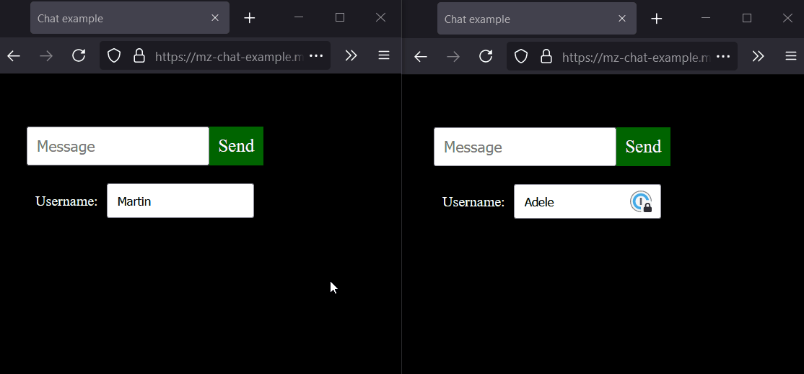
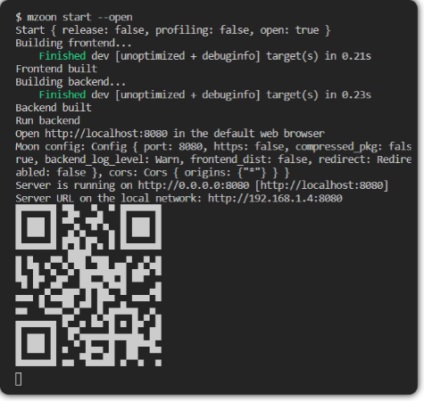
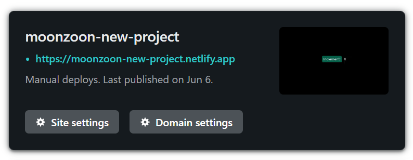
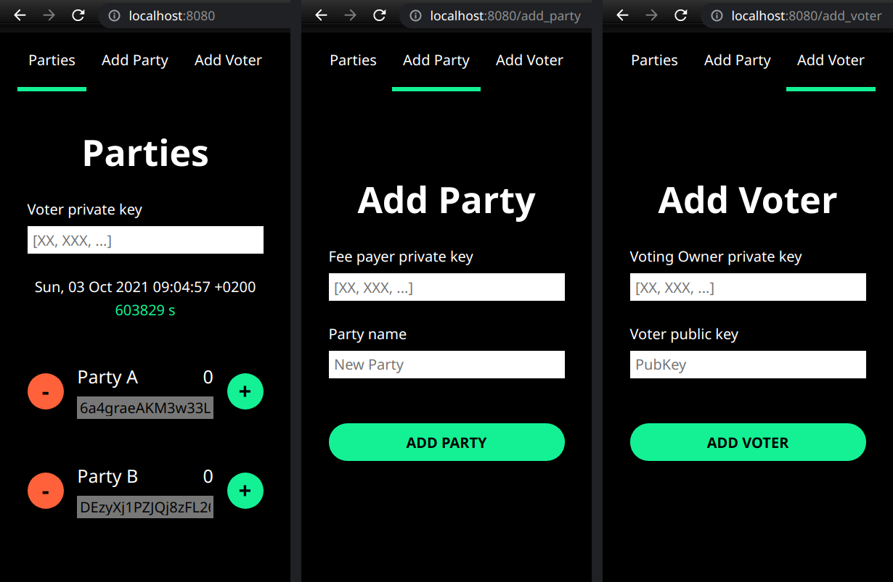
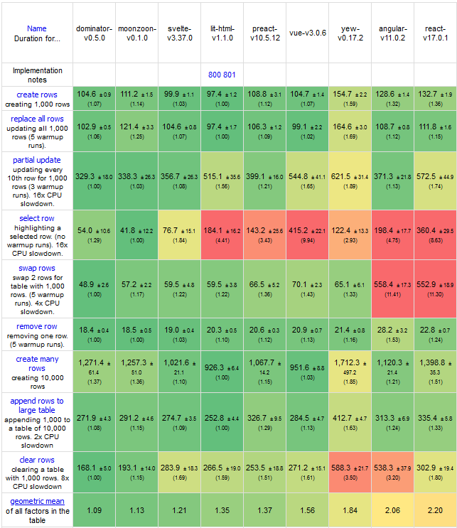

  

  

### [moonzoon.rs](http://moonzoon.rs) | [martin@moonzoon.rs](mailto:martin@moonzoon.rs) | [Discord](https://discord.gg/eGduTxK2Es)

---

### _"We don't want to lose time and money due to millions of unnecessary technical micro-decisions."_

---

**MoonZoon** is a Rust Fullstack Framework.

<table>
    <td>
        <ul>
            <li>NO Javascript</li>
            <li>NO CSS</li>
            <li>NO HTML</li>
            <li>NO REST</li>
            <li>NO GraphQL</li>
            <li>NO SQL</li>
            <li>NO Analysis Paralysis</li>
            <li>NO Wheel Reinventing</li>
            <li>NO Passwords*</li>
        </ul>
    </td>
    <td>
        <ul>
            <li>Rust</li>
            <li>Fast</li>
            <li>Simple</li>
            <li>Scalable</li>
            <li>SEO</li>
            <li>Auth</li>
            <li>MoonZoon CLI</li>
            <li>Easy Deploy</li>
            <li>Offline Support</li>
        </ul>
    </td>
</table>

\* Authentication methods are described in [Backend](docs/backend.md).md

---

# Demos

## New Project Template [on Netlify](https://moonzoon-new-project.netlify.app/) | [Template](https://github.com/MoonZoon/MoonZoon/tree/main/crates/mzoon/new_project)
   - Used by the command `mzoon new` (see the section [Create & Run project](#create--run-project) below)

## TodoMVC [on Heroku](https://moonzoon-todomvc.herokuapp.com/) | [Repo](https://github.com/MoonZoon/todomvc)
   - Up-to-date alternative in this repo: [examples/todomvc](examples/todomvc)

## GUI Benchmark [on Heroku](https://moonzoon-demo.herokuapp.com/) | [Repo](https://github.com/MoonZoon/demo)
   - Up-to-date alternative in this repo: [examples/js_framework_benchmark](examples/js_framework_benchmark)

## [Production apps in development]
   - @TODO

## Chat [on Clever Cloud](https://mz-chat-example.mzoon.app/)
   - Up-to-date alternative in this repo: [examples/chat](examples/chat)
   - Related blog post: _"Chat example, MoonZoon Cloud [[dev.to](https://dev.to/martinkavik/moonzoon-dev-news-5-chat-example-moonzoon-cloud-5de4) / [MD](docs/articles/dev_news_5.md)]_.

      

---

# Create & Run project

1. Install the latest stable [Rust](https://www.rust-lang.org/tools/install). (Or upgrade with `rustup update stable`.)
1. `cargo install mzoon --git https://github.com/MoonZoon/MoonZoon --locked`
1. `mzoon new my_counter`
1. `cd my_counter`
1. `mzoon start --open`

   

---

# Deploy project

## Both Frontend & Backend

MoonZoon apps have been deployed to [Heroku](https://www.heroku.com/) ([buildpack](https://github.com/MoonZoon/heroku-buildpack-moonzoon)), [Clever Cloud](https://www.clever-cloud.com/) and [CapRover](https://www.clever-cloud.com/). [DigitalOcean App Platform](https://www.digitalocean.com/products/app-platform) is planned. However, no solution was simple enough. That's why we need [MoonZoon Cloud](docs/cloud.md). But I plan to include `Dockerfile` soon so we have other options in the meantime. Please, write to [chat](https://discord.gg/eGduTxK2Es) when you have some questions regarding deployment.

## Frontend-only

1. `mzoon build --release --frontend-dist netlify` 
   - Hosting name (`netlify`) is optional.
2. Drag & drop the `frontend_dist` directory to [Netlify](https://www.netlify.com/). 

   

---

# Examples

- [**Examples**](examples) in the repo [See [development.md](docs/development.md) for instructions how to run them.]

- [Raytracer on MoonZoon](https://github.com/MartinKavik/ray_tracer) [Not maintained)

- [Voting system](https://github.com/MartinKavik/voting-solana-moonzoon) on the [Solana](https://solana.com/) blockchain. [Not maintained)

   

---

# Blog

- Cure for Web Development [[Medium](https://martinkavik.medium.com/cure-for-web-development-65003afb701f) / [dev.to](https://dev.to/martinkavik/cure-for-web-development-nnn) / [MD](docs/articles/cure_for_web_development.md)]

- Rust on the Frontend and Backend [[Always Bet on Rust](https://blog.abor.dev/p/moonzoon)]

### Dev News

1. CLI, Build pipeline, Live-reload, HTTPS [[dev.to](https://dev.to/martinkavik/moonzoon-dev-news-1-cli-build-pipeline-live-reload-https-1ba6) / [MD](docs/articles/dev_news_1.md)]

1. Live demo, Zoon, Examples, Architectures [[dev.to](https://dev.to/martinkavik/moonzoon-dev-news-2-live-demo-zoon-examples-architectures-2oem) / [MD](docs/articles/dev_news_2.md)]

1. Signals, React-like Hooks, Optimizations [[dev.to](https://dev.to/martinkavik/moonzoon-dev-news-3-signals-react-like-hooks-optimizations-39lp) / [MD](docs/articles/dev_news_3.md)]

1. Actix, Async CLI, Error handling, Wasm-pack installer [[dev.to](https://dev.to/martinkavik/moonzoon-dev-news-4-actix-async-cli-error-handling-wasm-pack-installer-57cp) / [MD](docs/articles/dev_news_4.md)]

1. **Chat example, MoonZoon Cloud [[dev.to](https://dev.to/martinkavik/moonzoon-dev-news-5-chat-example-moonzoon-cloud-5de4) / [MD](docs/articles/dev_news_5.md)]**

---

# Documentation

### 1. [Philosophy & Non-Goals](docs/philosophy_and_non_goals.md).md

### 2. [Frontend](docs/frontend.md).md

### 3. [Backend](docs/backend.md).md

### 4. [CLI](docs/cli.md).md

### 5. [Cloud](docs/cloud.md).md

### 6. [Development](docs/development.md).md

---

# Size & Speed

- [MartinKavik/js-framework-benchmark](https://github.com/MartinKavik/js-framework-benchmark/tree/framework/moonzoon)

---

# FAQ

1. _"Why another framework? Are you mad??"_
   - I want to write products. Reliable products. Quickly. I want to enjoy the development. I don't want to play endlessly with tools, protocols and config files.

1. _"Is it production-ready? / What's the current progress?"_
   
   - The frontend part is almost ready. If you have a custom backend or don't need backend at all then you can start writing your new frontend app right now! And then deploy it wherever you want. I assume there'll be two bigger breaking changes - to improve color system (related [issue](https://github.com/MoonZoon/MoonZoon/issues/98)) and to improve event handlers - but the Rust compiler should make the future migration simple.
   
   - Realtime communication between frontend and backend works but neither virtual actors nor native database adapters have been implemented yet. However, [Actix](https://actix.rs/) API has been exposed to overcome these current limitations so you can treat the MoonZoon backend API as Actix with realtime messaging. I've successfully integrated Postgres (through [SeaORM](https://www.sea-ql.org/SeaORM/)) into a MoonZoon app developed for my client and I plan to integrate [BonsaiDb](https://bonsaidb.io/) to my another production app. Bonsai could be integrated as a scalable database and file storage into MoonZoon when I'll find it a suitable choice.  

   - Subscribe to `#news` channel on our [Discord server](https://discord.gg/eGduTxK2Es) to find out when MoonZoon is ready for your project. Or just let us know what blocks you from starting to develop with MZ. 

1. _"Who is developing it?"_
   - Martin Kavík (a former [Seed](https://seed-rs.org/) maintainer, Rust freelance developer) with the help of the awesome community.
   - [An interview with Martin Kavík](https://blog.abor.dev/p/moonzoon)

1. _"Could I help somehow? / Where can I find more information?_"
    - Join our [Discord chat](https://discord.gg/eGduTxK2Es) and don't hesitate to ask any questions or present your ideas.
    - Create a pull-request if you want to fix typos, dead links, weird Czech-English sentences, etc.
    - If you think MoonZoon will be useful for your project, I want to know that! (Use [chat](https://discord.gg/eGduTxK2Es) or [martin@moonzoon.rs](mailto:martin@moonzoon.rs)).
    - Don't hesitate to tell your friends about MoonZoon and feel free to share the link ([http://moonzoon.rs](http://moonzoon.rs)) on social platforms / forums / blogs / newsletters. 

1. _"Why Rust?"_
   - It's the best language.
        

        
Longer explanation

        I've written commercial or hobby projects in multiple languages (Js, CoffeeScript, TS, Elm, Elixir, PHP, C, C++, C#, Go, ..). However I want to write only in Rust. 

        Rust is hard to learn even for experienced developers because they have to unlearn many things and adapt thought process to Rust concepts and best practices. However, once you stop fighting the compiler, Rust takes your hand and push you to correct and efficient solutions. 

        I had similar feeling when I was learning to drive a car - it seems to be pretty difficult/strange from the start but once you get used to it, you know that each control / button / pedal has it's specific place and purpose for a good reason. And it makes even more sense when you learn low-level stuff - e.g. how the transmission and a clutch work.

        Steep learning curve also brings some benefits: 
        - It means that Rust doesn't hide real complexity behind too simple models.
        - It's almost impossible for complete beginners to publish incomplete/buggy libraries. 
        
        _

        Rust is designed so well that I feel nervous while I'm writing in other languages - I have to do compiler's work again in my head and think about weird things like typos in code, `null`s, `undefined`s, memory leaks, accidental mutations, how to write fast code without mutability, etc. It generates significant cognitive load so I can't focus so much on business logic and other important stuff.

        I don't believe you should use the most suitable language for a specific domain or problem at all costs. I think consistency among your / company projects, productivity and simplicity should have the highest priority. And Rust is a very universal language so I think it's a good choice for almost all cases.

        There are also things that should be improved (and are improving):
        1. Compilation is still slow, but it's not so frustrating now.
        1. IDE support still isn't very good because of Rust complex types and macros but thanks to [Rust Analyzer](https://rust-analyzer.github.io/) it's getting better every day.
        1. `target` folder (it's something like `node_modules`) can be pretty big.
        1. It's a bit difficult to combine sync and async world in some cases and choose the best async runtime and error handling libraries. Also async drop would be nice.
        1. `#[derive(xx)]` and `cargo install` may have a bit surprising behavior.
        1. It may be a bit difficult to pick compatible dependencies.

        So there is still room for improvements but even now I'm the most productive in Rust.

        

---

Thank you for reading! We are waiting for you on [Discord](https://discord.gg/eGduTxK2Es).
