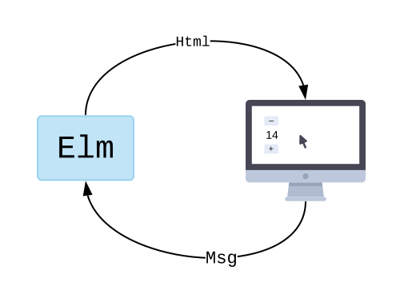

# MoonZoon Dev News (2): Live demo, Zoon, Examples, Architectures

The Zoon dev marathon is over. And it does something! And it does something on Heroku!

You can try it by yourself: [Live demo](https://moonzoon-demo.herokuapp.com/)

---

  <strong>Welcome to the MoonZoon Dev News!</strong>

  

[MoonZoon](https://moonzoon.rs) is a [Rust](https://www.rust-lang.org/) full-stack framework. If you want to read about new MZ features, architecture and interesting problems & solutions - Dev News is the right place.

---

# News

There are again two big news. I've written the Zoon core ([GitHub PR](https://github.com/MoonZoon/MoonZoon/pull/5)) and created a new GitHub [repo with the demo](https://github.com/MoonZoon/demo).

However the main goal for this iteration was to write working examples:
- [Counter](https://github.com/MoonZoon/MoonZoon/tree/main/examples/counter)
- [Counters](https://github.com/MoonZoon/MoonZoon/tree/main/examples/counters)
- [Counters without macros](https://github.com/MoonZoon/MoonZoon/tree/main/examples/counters_without_macros)

You can follow the updated [Development.md](https://github.com/MoonZoon/MoonZoon/blob/main/docs/development.md) to run those examples on your local machine.

---

Other significant changes:
- The dev server runs on HTTP by default and the Moon server(s) are configurable through environment variables. See updated [Cli.md](https://github.com/MoonZoon/MoonZoon/blob/main/docs/cli.md).
- The Zoon API has been changed a bit - see updated [Frontend.md](https://github.com/MoonZoon/MoonZoon/blob/main/docs/frontend.md). 
- I've written a super simple Heroku [buildpack](https://github.com/MoonZoon/heroku-buildpack-moonzoon). Feel free to improve it (e.g. to use cache).

---

And I would like to thank:
- [gilescope](https://github.com/gilescope) for MoonZoon improvements in PRs [3](https://github.com/MoonZoon/MoonZoon/pull/3) and [4](https://github.com/MoonZoon/MoonZoon/pull/4). 
- [sagiegurari](https://github.com/sagiegurari) for very quick integration of my PRs into his awesome [cargo-make](https://github.com/sagiegurari/cargo-make). This task runner is very useful for both MoonZoon and Seed.

---

# Frontend framework architectures

The basic purpose of all frontend frameworks is to present some useful data to users and handle user reactions to those presented data.

## The Elm architecture

The Elm architecture (TEA) is the most accurate representation of that purpose definition. 

The official [Elm guide](https://guide.elm-lang.org/architecture/) explains TEA this way:

--

The Elm program produces HTML to show on screen, and then the computer sends back messages of what is going on. "They clicked a button!"

What happens within the Elm program though? It always breaks into three parts:

   - Model — the state of your application
   - View — a way to turn your state into HTML
   - Update — a way to update your state based on messages

These three concepts are the core of The Elm Architecture.

--

However every architecture shows its trade-offs when our apps becomes larger and larger.

In the case of TEA, you'll soon find out your code consists of 4 big isolated trees - `Model`, `view`, `update` and `Msg`. But many parts of your application need to use only a part of each tree and almost nothing more. 

A typical example is a page. A page with a contact form and a page with a login form use different data and business logic and render different elements. However both pages probably want to know what user is logged in.

@TODO picture 4 trees |, two pages ---- + context / user ; PageMsg, PageModel, PageUpdate, PageView

As the result, developers cut the trees into pieces and group those pieces together with pieces belonging to other trees. And that's how components are born in TEA. However they are grouped mostly logically than by a language construct so developers tend to start searching for a stronger grouping mechanism and remove flexibility by some cumbersome abstractions. And then they add an extra abstraction layer for shared data (e.g. the logged user in our example)...

--- image spiral of hell / layers / -> dante inferno <-

There are also two data features that are difficult to take into account in TEA:
- A) You can't use most "raw" data directly for rendering.
   - When you need to round real numbers to show nice values in your e-shop orders. 
   - There are also much more complex transformations - for instance when you need to interpolate values for your charts.

- B) Not all data are equally important for your business and for all app parts.
   - User's mail will be used by many pages and you really don't want to accidentally modify it or use its old value.
   - The shadow size of an animated button will be interesting probably only for the related button.

In TEA we have only one `Model`. It means our business data will be mixed with precomputed and temporary data. And relations between "raw" and "derived" data won't be obvious on the first look.

So I think TEA is a paragon of "the beauty of simplicity" and it allows to write very reliable apps with readable code. However it makes writing reusable app parts difficult and it lacks some mechanisms for data management within larger apps. Another problem is difficult optimization of apps based on TEA in many programming languages.

## Component-based architecture

---

And that's all for today! 
Thank You for reading and I hope you are looking forward to the next episode.

Martin

P.S.
We are waiting for you on [Discord](https://discord.gg/eGduTxK2Es).

