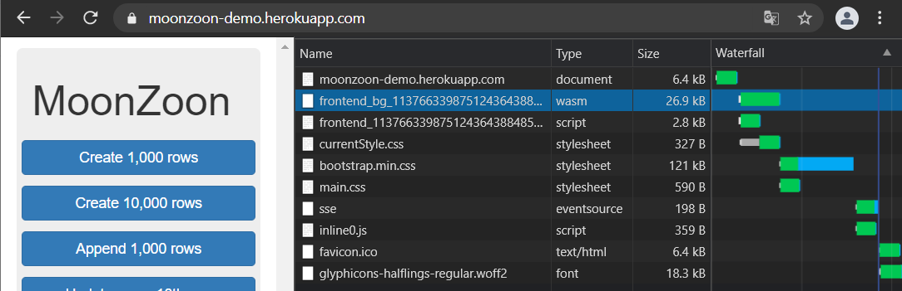
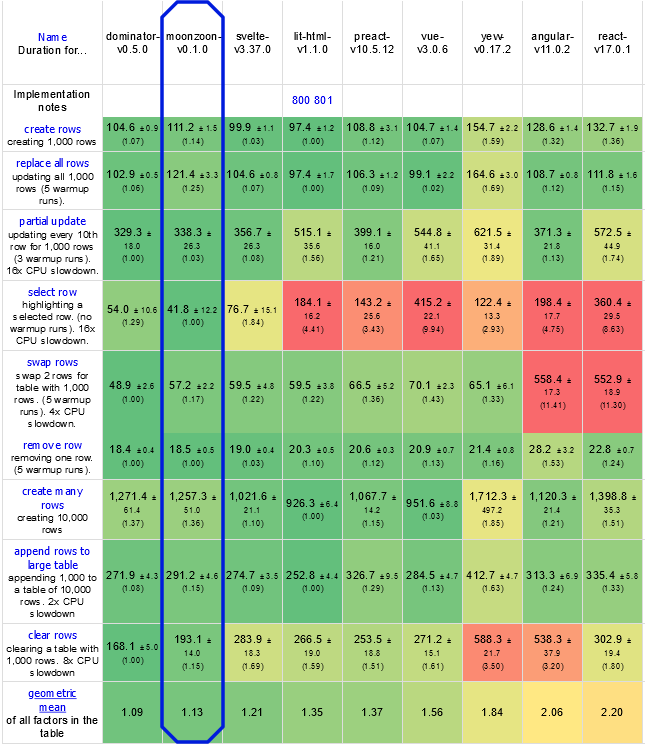

# MoonZoon Dev News (3): Signals, React-like Hooks, Optimizations

It's small.



It's fast.

[](https://raw.githubusercontent.com/MoonZoon/MoonZoon/main/docs/articles/images/frontend_frameworks_benchmark_screen.png)

What is it?

Rewritten Zoon!

You can try it by yourself: [Live demo](https://moonzoon-demo.herokuapp.com/)

---

<p align="center">
  <strong>Welcome to the MoonZoon Dev News!</strong>
</p>

<p align="center">
  
</p>


[MoonZoon](https://moonzoon.rs) is a [Rust](https://www.rust-lang.org/) full-stack framework. If you want to read about new MZ features, architecture and interesting problems & solutions - Dev News is the right place.

---

# Chapters
- [News](#news)
- [Old Zoon architecture](#old-zoon-architecture) - How React and Rust Hooks work
- [New Zoon architecture](#new-zoon-architecture) - Signals: You can do it without a Virtual DOM
- [Builder pattern with rules](#builder-pattern-with-rules) - Yes, builder pattern can support required parameters
- [Optimizations](#optimization) - Need for speed. The size matters.

---

# News

1. Zoon API almost doesn't use macros, it's safer, more expressive and compiler-friendly.
    - Working [examples](https://github.com/MoonZoon/MoonZoon/tree/main/examples) rewritten with the new API: `counter`, `counters`, `js-framework-benchmark`.
    - [Docs](https://github.com/MoonZoon/MoonZoon#documentation) updated to reflect changes.
    - The trade-off is slightly increased verbosity for `Element` APIs.

1. A new article [_"Rust on the Frontend and Backend"_](https://blog.abor.dev/p/moonzoon) on the blog _Always Bet On Rust_
   - _"An interview with Martin Kavík, creator of the MoonZoon full-stack framework"_

1. The [demo project](https://github.com/MoonZoon/demo) and [heroku-buildpack](https://github.com/MoonZoon/heroku-buildpack-moonzoon) updated. You can use them as a starting point for your experimental MoonZoon apps.

1. The MoonZoon [benchmark](https://github.com/MartinKavik/js-framework-benchmark/tree/framework/moonzoon) is ready to be merged (at the time of writing) to [krausest/js-framework-benchmark](https://github.com/krausest/js-framework-benchmark), however I want to wait until MoonZoon is more mature. 

1. You don't have to be afraid to look at `zoon` and `static_ref_macro` [crates](https://github.com/MoonZoon/MoonZoon/tree/main/crates) code. 
   - They are clean enough thanks to awesome libraries [once_cell](https://crates.io/crates/once_cell), [futures-signals](https://crates.io/crates/futures-signals) and [dominator](https://crates.io/crates/dominator).

1. Some new APIs, configs, features and Brotli / Gzip compression integrated.

---

I would like to thank:
- [Pauan](https://github.com/Pauan) for lightning fast resolving of my problems with his libs `futures-signals` and `dominator`.
- [Alexhuszagh](https://github.com/Alexhuszagh) for working on [lexical](https://crates.io/crates/lexical) and answering my [questions](https://github.com/Alexhuszagh/rust-lexical/issues/34#issuecomment-832250773).

---

This blog post is a bit longer but I hope you'll enjoy it!

---

# Old Zoon architecture
> How React and Rust Hooks work

First, I would like to write this sentence to sound clever: _"The old architecture was based on topologically-aware functions with stable call graph identifiers and local states stored in a heterogenous vector."_

Unfortunately, it's not my original idea. It powers [React Hooks](https://reactjs.org/docs/hooks-intro.html). Or [moxie](https://moxie.rs/). Or [Crochet](https://github.com/raphlinus/crochet).

And now the explanation what is it and why it doesn't work well enough to stay in Zoon (just like all over-engineered stuff).

--

So let's say we have `main` and 3 simple functions:

```rust
fn main() {
    loop {
        amber()
    }
}

fn amber() {
    mike()
}

fn mike() {
    layla_rose();
    layla_rose()
}

fn layla_rose() { }
```

Let's add a counter with some helpers and `println`s:

```rust
use std::sync::atomic::{AtomicUsize, Ordering};
static COUNTER: AtomicUsize = AtomicUsize::new(0);
fn call_id() -> usize { COUNTER.load(Ordering::SeqCst) }
fn increment_call_id() { COUNTER.fetch_add(1, Ordering::SeqCst); }
fn reset_call_id() { COUNTER.store(0, Ordering::SeqCst) }

fn main() {
    for _ in 0..3 { 
        amber();
        reset_call_id()
    }
}

fn amber() {
    increment_call_id();
    println!("amber id: {}", call_id());
    mike()
}

fn mike() {
    increment_call_id();
    println!("mike id: {}", call_id());
    layla_rose();
    layla_rose()
}

fn layla_rose() {
    increment_call_id();
    println!("layla_rose id: {}", call_id());
}
```

When you run the code ([Rust Playground](https://play.rust-lang.org/?version=stable&mode=debug&edition=2018&gist=542bca0402771da40176bdc373d5bc21)), you should see the loop of the sequence:
```
amber id: 1
mike id: 2
layla_rose id: 3
layla_rose id: 4
```

Now you can apply some "magic" to our functions with [proc macros](https://github.com/anp/moxie/blob/33c84788885322895a3f26ce1f5a70a5dbe2d237/topo/macro/src/lib.rs) and/or closures to hide unnecessary counter helpers. The result will look like:

```rust
fn main() {
    for _ in 0..3 { run(amber) }
}

#[i_am_special]
fn amber() {
    println!("amber id: {}", call_id());
    mike()
}

#[i_am_special]
fn mike() {
    println!("mike id: {}", call_id());
    layla_rose();
    layla_rose()
}

#[i_am_special]
fn layla_rose() {
    println!("layla_rose id: {}", call_id());
}
```

But let's get back to our non-macro example and improve it by adding `STATES` and the _hook_ `use_age`. ([Rust Playground](https://play.rust-lang.org/?version=stable&mode=debug&edition=2018&gist=3bbcdab68607c80fcd340f3ad3e39744))
   - _Note:_ The code below may look a bit scary but you don't have to understand all implementation details.

```rust
use std::sync::atomic::{AtomicUsize, Ordering};
static COUNTER: AtomicUsize = AtomicUsize::new(0);
fn call_id() -> usize { COUNTER.load(Ordering::SeqCst) }
fn increment_call_id() { COUNTER.fetch_add(1, Ordering::SeqCst); }
fn reset_call_id() { COUNTER.store(0, Ordering::SeqCst) }

use std::{sync::Mutex, collections::HashMap};
use once_cell::sync::Lazy;
static STATES: Lazy<Mutex<HashMap<usize, u8>>> = Lazy::new(Mutex::default);

fn use_age(default_value: impl FnOnce() -> u8 + Copy) -> u8 {
    *STATES.lock().unwrap().entry(call_id()).or_insert_with(default_value)
}

fn main() {
    for _ in 0..3 { 
        amber(32);
        println!("{:-<28}", "-");
        reset_call_id()
    }
}

fn amber(age: u8) {
    increment_call_id();
    let age = use_age(|| { println!("Saving amber's state!"); age });
    println!("amber id: {}, age: {}", call_id(), age);
    mike(15)
}

fn mike(age: u8) {
    increment_call_id();
    let age = use_age(|| { println!("Saving  mike's state!"); age });
    println!("mike id: {}, age: {}", call_id(), age);
    layla_rose(26);
    layla_rose(22)
}

fn layla_rose(age: u8) {
    increment_call_id();
    let age = use_age(|| { println!("Saving layla_rose's state!"); age });
    println!("layla_rose id: {}, age: {}", call_id(), age);
}
```

The output:
```
Saving amber's state!
amber id: 1, age: 32
Saving  mike's state!
mike id: 2, age: 15
Saving layla_rose's state!
layla_rose id: 3, age: 26
Saving layla_rose's state!
layla_rose id: 4, age: 22
----------------------------
amber id: 1, age: 32
mike id: 2, age: 15
layla_rose id: 3, age: 26
layla_rose id: 4, age: 22
----------------------------
amber id: 1, age: 32
mike id: 2, age: 15
layla_rose id: 3, age: 26
layla_rose id: 4, age: 22
----------------------------
```

The main fact: Closures passed to the `use_age` hook are invoked only once. `use_age` invokes them only if it doesn't find the age from the previous iteration in `STATES`.

Another important fact: `STATES` is a key-value storage, where the key is _call_id_ and the value is `u8` (aka _age_).

So.. do we have nice React Hooks and the world is smiling? 

Yeah, until a wild condition appears...

```rust
mike(30)
if day == "good_day" {
    layla_rose(26)
} else {
    amber(60)
}
```

The first iteration with a `good_day`:
```rust
mike(30)   // call id == 1  ;  age 30 saved
if day == "good_day" {
    layla_rose(26)   // call id == 2 ; age 26 saved
} else {
    amber(60)    // not called
}
```

The next iteration with a `bad_day`:
```rust
mike(30)   // call id == 1  ; age 30 loaded
if day == "good_day" {
    layla_rose(26)   // not called
} else {
    amber(60)    // call id == 2  ; age 26 loaded
}
```

Output ([Rust Playground](https://play.rust-lang.org/?version=stable&mode=debug&edition=2018&gist=d3f2e3a7cb1024730f88fbe1e73617ae)):

```
Saving mike's state!
mike id: 1, age: 30
Saving layla_rose's state!
layla_rose id: 2, age: 26
----------------------------
mike id: 1, age: 30
amber id: 2, age: 26
----------------------------
mike id: 1, age: 30
layla_rose id: 2, age: 26
----------------------------
```

You would be really surprised if a Tinder developer accidentally wrapped a React component in a condition and you plan a date with Amber...

That's why there are official [Rules of Hooks](https://reactjs.org/docs/hooks-rules.html):

> - Don’t call Hooks inside loops, conditions, or nested functions.
> - Don’t call Hooks from regular JavaScript functions.

Our call ids based on a counter / indices are just not _stable_ enough.

Fortunately, Rust offers more tools to fight with hooks limitations.

We can get the [Location](https://doc.rust-lang.org/std/panic/struct.Location.html) of the caller. It means we know where exactly in the source code has been a function called. So we can distinguish different calls by their caller, even if their index is equal. 

We can leverage newer Rust built-in attribute [#[track_caller]](https://rust-lang.github.io/rfcs/2091-inline-semantic.html) in combination with [Location::caller](https://doc.rust-lang.org/stable/std/panic/struct.Location.html#method.caller). The code is starting to be pretty complex ([Rust Playground](https://play.rust-lang.org/?version=stable&mode=debug&edition=2018&gist=474dfd8daa9078467fc77016142b036a)).

```rust
use std::sync::atomic::{AtomicUsize, Ordering};
use std::panic::Location;
static COUNTER: AtomicUsize = AtomicUsize::new(0);
#[track_caller]
fn call_id() -> (usize, &'static Location<'static>) { 
    (COUNTER.load(Ordering::SeqCst), Location::caller()) 
}
fn increment_call_id() { COUNTER.fetch_add(1, Ordering::SeqCst); }
fn reset_call_id() { COUNTER.store(0, Ordering::SeqCst) }

use std::{sync::Mutex, collections::HashMap};
use once_cell::sync::Lazy;
static STATES: Lazy<Mutex<HashMap<(usize, &'static Location), u8>>> = Lazy::new(Mutex::default);

#[track_caller]
fn use_age(default_value: impl FnOnce() -> u8 + Copy) -> u8 {
    *STATES.lock().unwrap().entry(call_id()).or_insert_with(default_value)
}

fn main() {
    for i in 0..3 { 
        root(if i % 2 == 0 { "good_day" } else { "bad_day" });
        println!("{:-<28}", "-");
        reset_call_id()
    }
}

fn root(day: &str) {
    mike(30);
    if day == "good_day" {
        layla_rose(26)
    } else {
        amber(60)
    }
}

#[track_caller]
fn mike(age: u8) {
    increment_call_id();
    let age = use_age(|| { println!("Saving mike's state!"); age });
    println!("mike id: {:?}, age: {}", call_id(), age);
}

#[track_caller]
fn amber(age: u8) {
    increment_call_id();
    let age = use_age(|| { println!("Saving amber's state!"); age });
    println!("amber id: {:?}, age: {}", call_id(), age);
}

#[track_caller]
fn layla_rose(age: u8) {
    increment_call_id();
    let age = use_age(|| { println!("Saving layla_rose's state!"); age });
    println!("layla_rose id: {:?}, age: {}", call_id(), age);
}
```

Updated output (notice Amber's age and `Saving amber's state!`):
```
Saving mike's state!
mike id: (1, Location { file: "src/main.rs", line: 29, col: 5 }), age: 30
Saving layla_rose's state!
layla_rose id: (2, Location { file: "src/main.rs", line: 31, col: 9 }), age: 26
----------------------------
mike id: (1, Location { file: "src/main.rs", line: 29, col: 5 }), age: 30
Saving amber's state!
amber id: (2, Location { file: "src/main.rs", line: 33, col: 9 }), age: 60
----------------------------
mike id: (1, Location { file: "src/main.rs", line: 29, col: 5 }), age: 30
layla_rose id: (2, Location { file: "src/main.rs", line: 31, col: 9 }), age: 26
----------------------------
```

To make the code more robust we'll need to track also ancestors. Otherwise we may have calls with equal index and direct callers but they are actually different because they have different callers of callers... So.. we need to create a simple _blockchain_ where each call has a hash of the previous call (yeah, another buzzword for SEO..)

However Nemesis for all Javascript and Rust Hooks are loops. Different calls in loops may have equal both index and location. It means we need another factor to correctly distinguish calls - `keys`. Unfortunately they need to be provided by developer because they depend on application data.

Many frameworks (with or without Hooks) support `keys`:
- [React Keys](https://reactjs.org/docs/reconciliation.html#keys)
- [Elm Html.Keyed](https://guide.elm-lang.org/optimization/keyed.html)
- [moxie/topo slots](https://docs.rs/topo/0.13.2/topo/attr.nested.html#slots)
- [svelte keyed each blocks](https://svelte.dev/tutorial/keyed-each-blocks)

When the developer forgets to define keys, the app may be slower or doesn't work as expected (look at the Svelte demonstration above).

So... from the frontend app developer point of view, Hooks (especially Rust ones) may be a useful tool to reduce boilerplate and introduce local state for function-based components, but the developer has to follow some artificial rules.

--

Let's move to the technical challenges of Hooks.

1. Complexity. It's pretty hard to implement Hooks correctly, especially due to many edge-cases and macros. It also mean a lot of code bloat if you are not careful enough.

1. Good luck with Hooks integration into the framework with asynchronous rendering - you may get lost in the Dark caller forest (just a note from MoonZoon trenches).

1. We were working only with the _age_ in our examples. Hooks have to support as many types as possible (not only `u8`). It means we need a heterogenous storage for user data, probably based on [Any](https://doc.rust-lang.org/std/any/trait.Any.html) (if you know Typescript [any](https://www.typescriptlang.org/docs/handbook/2/everyday-types.html#any), Rust `Any` may open similar gates of hell).

1. It's pretty hard to start a new iteration in a non-root "node" (when you want to invoke only the function in the call graph representing a component with changed data).

1. However the Hooks Achilles' heel is the storage performance. When you decide to use the simplest solution - a `HashMap` with `Box<dyn Any>` as values:

   - `Box` and `Any` means a lot of type gymnastics and checks and allocations.

   - `HashMap`'s default hash function isn't the fastest one, but the replacement with a faster non-secure one didn't help to increase speed in practice.

   - `HashMap` resizing is pretty slow - it has to move all its items to the new location after the reallocation. [griddle](https://crates.io/crates/griddle) helps to eliminate resizing spikes, but it doesn't help too much with the overall speed.

As the result, Zoon's code was a slow spaghetti monster. It was working good enough for cca 2_000 elements, but when  there were more complex business logic and more elements then the app becomes too slow for comfortable usage.

I've also tried more mature libraries instead of my code but the performance didn't change too much. 

Then I remembered the term _Sunk cost fallacy_ from the awesome book [Thinking, Fast and Slow](https://en.wikipedia.org/wiki/Thinking,_Fast_and_Slow) and with the words "Don't love your code, no code no bugs" I selected most Zoon files and hit my favorite key: `Delete`.

---

# New Zoon architecture
> Signals: You can do it without a Virtual DOM

So Hooks was a dead end. The Elm architecture has its own problems (explained in the [previous post](https://dev.to/martinkavik/moonzoon-dev-news-2-live-demo-zoon-examples-architectures-2oem#frontend-framework-architectures)). I don't want to invent another complex component system with templates. What now?

Let's learn from the past and see what works and what doesn't.

- Hooks - Simple creation of local states helps to write element/component libraries and don't pollute our business data with GUI-specific variables.

- TEA - Single-source of truth (aka `Model`) eliminates bugs related to state synchronization.

- TEA - Asynchronous "pipelines" may be hard to follow in the source code without an `await/async` mechanism. Imagine a chain of HTTP requests with error handling and some business logic.

- Many frameworks / GUI libraries often try to store and manage all objects representing elements/components by themselves and use the target platform only as a "canvas" where they render elements.
   
   - Why write a custom DOM when we still need to use the browser DOM? The custom DOM then basically becomes a cache. And what are the [most difficult things](https://martinfowler.com/bliki/TwoHardThings.html) in computer science?
   
   - Why to store and manage objects when we only want to render a HTML string for a Google bot?

- Passing properties down to child elements/components may lead to boilerplate (TEA) and then to cumbersome abstractions (many frameworks). TEA-like frameworks try to mitigate it with [Pub/Sub](https://en.wikipedia.org/wiki/Publish%E2%80%93subscribe_pattern) mechanisms.

- There are often problems with _keys_ for element/component lists (explained in the previous chapter).

- Virtual DOM + Asynchronous rendering (the render waits for the next [animation frame](https://developer.mozilla.org/en-US/docs/Web/API/window/requestAnimationFrame)) 
   - Adds a lot of complexity and causes bugs. 
   - The typical bug in most frameworks is a "jumping cursor" in text inputs ([Elm issue with demonstation](https://github.com/elm/virtual-dom/issues/138), [React explanation](https://stackoverflow.com/questions/28922275/in-reactjs-why-does-setstate-behave-differently-when-called-synchronously/28922465#28922465)).
   - Text selection is [pretty hard to manage](https://github.com/seed-rs/seed/blob/master/src/browser/util.rs#L161-L260) in the browser, especially with async rendering.

- Many native browser elements behave quite unpredictably and it's very hard to set them correctly. There has to be a layer above them to protect the app developer.
   - _"Did you know #456: [Setting element attributes is order-sensitive](https://github.com/seed-rs/seed/issues/335)?"_

Now I'll show you examples with a new Zoon API with explanations how they corresponds with the notes above.

```rust
use zoon::*;

#[static_ref]
fn counter() -> &'static Mutable<i32> {
    Mutable::new(0)
}

fn increment() {
    counter().update(|counter| counter + 1)
}

fn decrement() {
    counter().update(|counter| counter - 1)
}

fn root() -> impl Element {
    Column::new()
        .item(Button::new().label("-").on_press(decrement))
        .item(Text::with_signal(counter().signal()))
        .item(Button::new().label("+").on_press(increment))
}
```

The function `counter()` is marked by the attribute `#[static_ref]`. It means the function is transformed by a procedural macro into this:

```rust
fn counter() -> &'static Mutable<i32> {
    use once_cell::race::OnceBox;
    static INSTANCE: OnceBox<Mutable<i32>> = OnceBox::new();
    INSTANCE.get_or_init(move || Box::new(Mutable::new(0)))
}
```
- The macro is defined in the crate `static_ref_macro` in the [MoonZoon repo](https://github.com/MoonZoon/MoonZoon/tree/main/crates).
- The macro currently uses `OnceBox`. It may use `OnceCell` or probably `lazy_static!`.
- You can deactivate the macro by a Zoon feature flag `static_ref`.

`Mutable` is very similar to [RwLock](https://doc.rust-lang.org/std/sync/struct.RwLock.html). However it has one unique feature - it sends a _signal_ on change.

What's the difference between these lines?
```rust
// Creates a new `Text` element with a counter value converted to `String`
.item(Text::new(counter().lock_ref().to_string()))

// The same like the previous one, but without the explicit locking.
.item(Text::new(counter().map(ToString::to_string)))

// The method `.item` expects the parameter `IntoElement`.
// Many Rust basic types (&str, Cow, i32, ..) implements `IntoElement` by creating a new `Text`.
// And we can call `.get()` because our `i32` counter implements `Copy`.
.item(counter().get())
```
So.. they are basically same. It just creates a `Text` element with a _static_ value. It means the text doesn't change at all. We can only replace the `Text` element with a new if we want to change it.  

---

# Builder pattern with rules
> Yes, builder pattern can support required parameters

---

# Optimizations
> Need for speed. The size matters.

---

And that's all for today! 
Thank You for reading and I hope you are looking forward to the next episode.

Martin

P.S.
We are waiting for you on [Discord](https://discord.gg/eGduTxK2Es).

