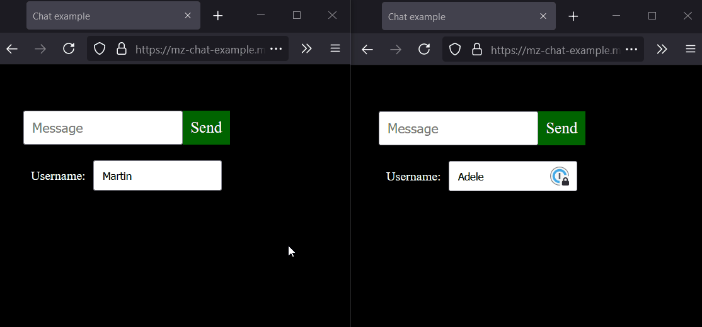
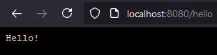

# MoonZoon Dev News (5): Chat example, MoonZoon Cloud

Let's chat!



Live demo: [mz-chat-example.mzoon.app](https://mz-chat-example.mzoon.app/)

---

<p align="center">
  <strong>Welcome to the MoonZoon Dev News!</strong>
</p>

<p align="center">
  
</p>

[MoonZoon](https://moonzoon.rs) is a [Rust](https://www.rust-lang.org/) full-stack framework. If you want to read about new MZ features, architecture and interesting problems & solutions - Dev News is the right place.

---

# Chapters
- [News](#news)
- [Chat example](#chat-example)
- [MoonZoon Cloud](#moonzoon-cloud)

---

# News

- Chat example works! The most of this blog post will cover it - I hope it will be interesting even for people who hear about the MoonZoon for the first time.

- The second chapter is dedicated to the MoonZoon Cloud - research & reasons.

- I've updated my sponsors page and added "Sponsor" button to MZ repositories. More info in the MZ Cloud chapter. 

---

And I would like to thank:
- [Agathe](https://github.com/noisegrrrl) from [Clever Cloud](https://www.clever-cloud.com/en/) for excellent support and patience with my batches of annoying questions.
- To all my [sponsors](https://github.com/sponsors/MartinKavik). Thank you for wanting to improve web development with me. Current sponsors:
   - [tokcum](https://github.com/tokcum) ($96 / month)
   - [arn-the-long-beard](https://github.com/arn-the-long-beard) ($24 / m)
   - [Tomáš Lauer](https://github.com/TomciikL) ($24 / m)
   - [Jesus Guzman, Jr.](https://github.com/JesusGuzmanJr) ($10 / m)
   - [Colin Woodbury](https://github.com/fosskers) ($8 / m)
   - [Craig Mayhew](https://github.com/craigmayhew) ($8 / m)
   - [Dustin Bensing](https://github.com/pythoneer) ($8 / m)
   - [Dusty Pomerleau](https://github.com/dustypomerleau) ($8 / m)
   - [Jay Sistar](https://github.com/Type1J) ($8 / m)
   - [Ke Ding](https://github.com/DingDean) ($8 / m)
   - [Kuma Taro](https://github.com/km-tr) ($8 / m)
   - [sabine](https://github.com/sabine) ($8 / m)
   - [Shawn MacIntyre](https://github.com/smacintyre) ($8 / m)

---

# Chat example

- You've already seen the GIF at the top and probably tried the [live demo](https://mz-chat-example.mzoon.app/). 
- The demo is based on the example in the [MoonZoon repo](https://github.com/MoonZoon/MoonZoon/tree/main/examples/chat). You can follow these [steps](https://github.com/MoonZoon/MoonZoon/blob/main/docs/development.md) to run it on your local machine.

The example's code is split into three crates: `frontend`, `backend` and `shared`.

## Shared

`chat/shared/src/lib.rs`:

```rust
use moonlight::serde_lite::{self, Deserialize, Serialize};

// ------ UpMsg ------

#[derive(Serialize, Deserialize, Debug)]
pub enum UpMsg {
    SendMessage(Message),
}

// ------ DownMsg ------

#[derive(Serialize, Deserialize, Debug)]
pub enum DownMsg {
    MessageReceived(Message),
}

// ------ Message ------

#[derive(Serialize, Deserialize, Clone, Debug)]
pub struct Message {
    pub username: String,
    pub text: String,
}
```

The only purpose of the `shared` crate is to provide items needed for frontend-backend communication.
- `UpMsg` is sent from the frontend to backend in a Fetch request.
- `DownMsg` is sent from the backend to frontend in a Server-Send Event stream. 

All items have to be (de)serializable because they are transferred as JSON. We use `serde_lite` instead of `serde` to reduce the Wasm file size of the frontend app.

`moonlight` is a MoonZoon crate and it works as a "bridge" between the frontend (Zoon) and backend (Moon).

## Backend

`chat/backend/src/main.rs`:

```rust
use moon::*;
use shared::{DownMsg, UpMsg};

async fn frontend() -> Frontend {
    Frontend::new().title("Chat example").append_to_head(
        "
        <style>
            html {
                background-color: black;
            }
        </style>",
    )
}

async fn up_msg_handler(req: UpMsgRequest<UpMsg>) {
    println!("{:?}", req);

    let UpMsgRequest { up_msg, cor_id, .. } = req;
    let UpMsg::SendMessage(message) = up_msg;

    sessions::broadcast_down_msg(&DownMsg::MessageReceived(message), cor_id).await;
}

#[moon::main]
async fn main() -> std::io::Result<()> {
    start(frontend, up_msg_handler, |_| {}).await
}
```

- The function `frontend` is invoked on the the web browser request (if the path doesn't start with `_api`). The response is HTML that starts the Zoon (the frontend part).

- The function `up_msg_handler` handles message requests from the Zoon. Zoon sends in the `UpMsgRequest`:
   - Your `UpMsg`.
   - New `CorId` (aka [_correlation id_](https://www.rapid7.com/blog/post/2016/12/23/the-value-of-correlation-ids/)) generated for each request.
   - `SessionId` generated in the Zoon app before it connects to the Moon.
   - `Option<AuthToken>` containing `String` defined in your Zoon app.

### Sessions

`sessions` are [_virtual actors_](https://www.microsoft.com/en-us/research/publication/orleans-distributed-virtual-actors-for-programmability-and-scalability/) managed by the Moon. Each `SessionActor` represents a live connection between Zoon and Moon apps.

You can send your `DownMsg` to all connected Zoon apps by calling `sessions::broadcast_down_msg` (demonstrated in the code snippet above).

If you want to send the message to only one `session` (e.g. to simulate a standard request-response mechanism):
```rust
let UpMsgRequest { up_msg, cor_id, session_id, .. } = req;
let UpMsg::SendMessage(message) = up_msg;

sessions::by_session_id()
    .get(session_id)
    .unwrap()
    .send_down_msg(&DownMsg::MessageReceived(message), cor_id).await;
```

Where `by_session_id()` returns an _actor index_. Then we try to find the actor and calls its method `send_down_msg`.

_Notes_: 

- All actor methods are asynchronous because the requested actor may live in another server or it doesn't live at all - then the Moon app has to start it and load its state into the main memory before it can process your call. And all those operations and the business logic processing take some time, so asynchronicity allows you to spend the time in better ways than just waiting.

- Index API will change a bit during the future development to support server clusters (e.g. `get` will be probably `async`).

### Actix

I was talking about it in the previous blog post so just one code snippet for newcomers:

```rust
use moon::*;
use moon::actix_web::{get, Responder};

async fn frontend() -> Frontend {
    Frontend::new().title("Actix example")
}

async fn up_msg_handler(_: UpMsgRequest<()>) {}

#[get("hello")]
async fn hello() -> impl Responder {
    "Hello!"
}

#[moon::main]
async fn main() -> std::io::Result<()> {
    start(frontend, up_msg_handler, |cfg|{
        cfg.service(hello);
    }).await
}
```



- `cfg` in the snippet is [actix_web::web::ServiceConfig](https://docs.rs/actix-web/4.0.0-beta.8/actix_web/web/struct.ServiceConfig.html)

## Frontend

The skeleton of `chat/frontend/src/lib.rs`:

```rust
use shared::{DownMsg, Message, UpMsg};
use zoon::{eprintln, *};

// ------ ------
//    Statics
// ------ ------
// ...

// ------ ------
//   Commands
// ------ ------
// ...

// ------ ------
//     View
// ------ ------
// ...

// ------ ------
//     Start
// ------ ------
// ...
```

### Statics

```rust
#[static_ref]
fn username() -> &'static Mutable<String> {
    Mutable::new("John".to_owned())
}

#[static_ref]
fn messages() -> &'static MutableVec<Message> {
    MutableVec::new()
}

#[static_ref]
fn new_message_text() -> &'static Mutable<String> {
    Mutable::new(String::new())
}

#[static_ref]
fn connection() -> &'static Connection<UpMsg, DownMsg> {
    Connection::new(|DownMsg::MessageReceived(message), _| {
        messages().lock_mut().push_cloned(message);
    })
    // .auth_token_getter(|| AuthToken::new("my_auth_token"))
}
```
- Data stored in functions marked by the attribute `#[static_ref]` are lazily initialized on the first call.

- Read the excellent [tutorial](https://docs.rs/futures-signals/0.3.20/futures_signals/tutorial/index.html) for `Mutable` and _signals_ in the `futures_signals` crate.

- A _correlation id_ is automatically generated and sent to the Moon with each request.

- A _session id_ is automatically generated when the `Connection` is created. Then it's sent with each `UpMsg`.

### Commands

```rust
fn set_username(name: String) {
    username().set(name);
}

fn set_new_message_text(text: String) {
    new_message_text().set(text);
}

fn send_message() {
    Task::start(async {
        connection()
            .send_up_msg(UpMsg::SendMessage(Message {
                username: username().get_cloned(),
                text: new_message_text().take(),
            }))
            .await
            .unwrap_or_else(|error| eprintln!("Failed to send message: {:?}", error))
    });
}
```

- `Task::start` spawn the given `Future`. (_Note:_ Multithreading in Zoon apps isn't supported yet.)

### View

The skeleton of the `View` section:

```rust
fn root() -> impl Element {
    Column::new()
        .s(Padding::new().all(30))
        .s(Spacing::new(20))
        .item(received_messages())
        .item(new_message_panel())
        .item(username_panel())
}

// ------ received_messages ------
// ...

// ------ new_message_panel ------
// ...

// ------ username_panel ------
// ...
```
- When the `root` function is invoked (_note:_ it's invoked only once), all elements are immediately created and rendered to the browser DOM. (It means, for instance, methods `Column::new()` or `.item(..)` writes to DOM.)

- `s` is the abbreviation for style. All _elements_ that implement the _ability_ `Styleable` have the method `.s(...)`. The method accepts all items that implement the trait `Style`.

- `Column` is a `div` with CSS properties `display: flex` and `flex-direction: column`.

- All built-in elements (`Column`, `Row`, etc.) have the HTML class similar to the element name, e.g. `column` or `row`.

```rust
// ------ received_messages ------

fn received_messages() -> impl Element {
    Column::new().items_signal_vec(messages().signal_vec_cloned().map(received_message))
}

fn received_message(message: Message) -> impl Element {
    Column::new()
        .s(Padding::new().all(10))
        .s(Spacing::new(6))
        .item(
            El::new()
                .s(Font::new().bold().color(NamedColor::Gray10).size(17))
                .child(message.username),
        )
        .item(
            El::new()
                .s(Font::new().color(NamedColor::Gray8).size(17))
                .child(message.text),
        )
}
```

- `Column::new().items_signal_vec(messages()..` means the `Column`'s items are synchronized with messages. I.e. when you add a new item to `messages`, the new item is rendered in the `Column`.

- `Spacing::new(6)` sets the CSS property `gap` to `6px`.

- `NamedColor` is a very small and temporary enum of colors. It will be replaced probably with color pallets or a compile-time color generator later. In the meantime, you can create your own enums or other items that implement the trait `Color`. See also the [Color section](https://github.com/MoonZoon/MoonZoon/blob/main/docs/frontend.md#color) in the MZ docs.

- It's surprisingly difficult to set the font size correctly. See [Size and Font Size sections](https://github.com/MoonZoon/MoonZoon/blob/main/docs/frontend.md#size) in the MZ docs for more info. `Font::size` just set `font-size` in `px` until I resolve it properly.

- `El` is a simple `div`. It must have one child (otherwise you get a compilation error).

```rust
// ------ new_message_panel ------

fn new_message_panel() -> impl Element {
    Row::new().item(new_message_input()).item(send_button())
}

fn new_message_input() -> impl Element {
    TextInput::new()
        .s(Padding::new().x(10))
        .s(Font::new().size(17))
        .focus()
        .on_change(set_new_message_text)
        .label_hidden("New message text")
        .placeholder(Placeholder::new("Message"))
        .on_key_down(|event| event.if_key(Key::Enter, send_message))
        .text_signal(new_message_text().signal_cloned())
}

fn send_button() -> impl Element {
    let (hovered, hovered_signal) = Mutable::new_and_signal(false);
    Button::new()
        .s(Padding::new().all(10))
        .s(Background::new()
            .color_signal(hovered_signal.map_bool(|| NamedColor::Green5, || NamedColor::Green2)))
        .s(Font::new().color(NamedColor::Gray10).size(20))
        .on_hovered_change(move |is_hovered| hovered.set(is_hovered))
        .on_press(send_message)
        .label("Send")
}
```
- `Row` is a `div` with the CSS property `display: flex`.

- `TextInput` is an HTML `input`. It has abilities:
   - `Styleable`
   - `KeyboardEventAware`
   - `Focusable`
   - `Hoverable`

- You have to call either `.label_hidden(..)` or `.id(..)` to improve [accessibility](https://developer.mozilla.org/en-US/docs/Web/Accessibility):
   - `label_hidden` sets `aria-label` to the given value.
   - When you set `id`, then it's expected you create a `Label` for the input. It's demonstrated in the following snippet.

```rust
// ------ username_panel ------

fn username_panel() -> impl Element {
    let id = "username_input";
    Row::new()
        .item(username_input_label(id))
        .item(username_input(id))
}

fn username_input_label(id: &str) -> impl Element {
    Label::new()
        .s(Font::new().color(NamedColor::Gray10))
        .s(Padding::new().all(10))
        .for_input(id)
        .label("Username:")
}

fn username_input(id: &str) -> impl Element {
    TextInput::new()
        .s(Padding::new().x(10))
        .id(id)
        .on_change(set_username)
        .placeholder(Placeholder::new("Joe"))
        .text_signal(username().signal_cloned())
}
```
- `Label` is an HTML `label`.

### Start

```rust
#[wasm_bindgen(start)]
pub fn start() {
    start_app("app", root);
    connection();
}
```
- The function `start` is invoked automatically from the Javascript code.
- Zoon's function `start_app` appends the element returned from the `root` function to the element with the id `app`.
   - You can also pass the value `None` instead of `"app"` to mount directly to `body` but it's not recommended.

### A question from MZ Discord

**JaySistar**: "Can a Connection contain app specific state? I thought that i saw that it could, but I don't know which example uses it. In the case of chat, it could be added, so that after a user has "logged in" the username wouldn't need to be sent with each message, but a "username" change message could be sent to change it."

**MartinKavik**: "Excellent question. It was the first time I was trying to write MZ actors (`SessionActor`) and to improve its API during the process. I'm not sure yet if the right solution would be to allow to add a custom state directly to `SessionActor`s or developers should create new custom actors like `UserActor` and create/remove them when "associated" `SessionActor` is created/removed. So I decided to choose the simplest approach for now (i.e. send `username` in the `Message`, basically keep the state in the Zoon app) and eventually revisit the chat example when actors API is stable enough."

# MoonZoon Cloud

MoonZoon development goes quite well. Some important Zoon APIs are still missing - like routing, timers or channels. But I've already written them during the [Seed](https://seed-rs.org/) development and their MoonZoon alternatives are designed so it's only matter of time. Moon is already usable for writing apps because `Up/DownMsg` communication works and for other cases you can use Actix directly. The last big missing Moon part is a virtual actor system. However distributable virtual actors are pretty useless without the platform where we can run them and without a storage where we can save their state. Also we would like to deploy simple apps without actors as soon as possible. We need the MoonZoon Cloud. 

MoonZoon Cloud is the serverless platform for your MoonZoon apps. Predictable pricing, simplicity and scalability are main goals.  

- The web administration will be written in MoonZoon.
- The CLI part will be implemented as extra `mzoon` commands.
- The default app URL will be `https://[your_app_name].mzoon.app`

## Current MZ Cloud state

Research. 

[Clever Cloud](https://www.clever-cloud.com/en/) looks like the best candidate for the MoonZoon Cloud infrastructure provider. The MZ chat example works without problems: [mz-chat-example.mzoon.app](https://mz-chat-example.mzoon.app/) (HTTP/2, automatic HTTPS on a custom domain, native support for Rust apps, API for almost everything, etc.). Their support is excellent. 

Another possible provider could be [Google Cloud Run](https://cloud.google.com/run) because it supports scaling to zero and also server-sent events. 
But Clever Cloud has more predictable pricing and it's less complex because you don't need to manage Docker containers.

However MZ Cloud can offer multiple providers in the future - it means you would be able to choose Clever or Google Cloud. (Please let me know if you know other suitable providers.)

## Why I'm creating MZ Cloud?

There are two reasons why I want to write MZ Cloud:

- It's the missing piece to complete my journey to an ideal web development experience.

- I need it for my MoonZoon apps.

- I hope it will be the main source of income for the MoonZoon development. So if you want to speed up the MZ development, make it sustainable and get early access to the Cloud (once it's ready for it) and other benefits - please visit my [Sponsors](https://github.com/sponsors/MartinKavik) page.

_Note:_ If the topic "Open-Source & Financial Struggle" is new to you, I've written down one idea how to resolve it and a list of related articles, videos and books: [OpenHope](http://openhope.net/).

_Note for Seed users_: I continue to maintain Seed as usual. Also I can imagine we can write tools for deploying Seed apps to the MZ Cloud when there is demand for it. However I'll focus mainly on my sponsors, because these people and companies rely on Seed and I want to cover their back and watch their successes. Also Seed is now basically feature-complete, I don't remember where somebody reported a bug, community is nice to newcomers and I can't work indefinitely for free.

Don't hesitate to write me (public or private message) if you have some questions about Cloud or ideas or requirements or other things on your mind. You are awesome, thank you.

---

And that's all for today! 
Thank You for reading and I hope you are looking forward to the next episode.

Martin

P.S.
We are waiting for you on [Discord](https://discord.gg/eGduTxK2Es).
