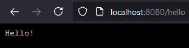

# Backend - Moon

---

## Basics

The **Chat** example:

```rust
use moon::*;
use shared::{DownMsg, UpMsg};

async fn frontend() -> Frontend {
    Frontend::new().title("Chat example").append_to_head(
        "
        <style>
            html {
                background-color: black;
            }
        </style>",
    )
}

async fn up_msg_handler(req: UpMsgRequest<UpMsg>) {
    println!("{:#?}", req);

    let UpMsgRequest { up_msg, cor_id, .. } = req;
    let UpMsg::SendMessage(message) = up_msg;

    sessions::broadcast_down_msg(&DownMsg::MessageReceived(message), cor_id).await;
}

#[moon::main]
async fn main() -> std::io::Result<()> {
    start(frontend, up_msg_handler, |_| {}).await
}
```

### 1. The App Initialization

1. The function `main` is invoked.

1. The function `frontend` is invoked on the the web browser request (if the path doesn't start with `_api`). The response is HTML that starts the Zoon (the frontend part).

1. The function `up_msg_handler` handles message requests from the Zoon. Zoon sends in the `UpMsgRequest`:
   - Your `UpMsg`.
   - New `CorId` (aka [_correlation id_](https://www.rapid7.com/blog/post/2016/12/23/the-value-of-correlation-ids/)) generated for each request.
   - `SessionId` generated in the Zoon app before it connects to the Moon.
   - `Option<AuthToken>` containing `String` defined in your Zoon app.

### 2. Calling Actor functions

`sessions` are [_virtual actors_](https://www.microsoft.com/en-us/research/publication/orleans-distributed-virtual-actors-for-programmability-and-scalability/) managed by the Moon. Each actor represents a live connection between Zoon and Moon apps.

You can send your `DownMsg` to all connected Zoon apps by calling `sessions::broadcast_down_msg` (demonstrated in the code snippet above).

If you want to send the message to only one `session` (e.g. to simulate a standard request-response mechanism):
```rust
let UpMsgRequest { up_msg, cor_id, session_id, .. } = req;
let UpMsg::SendMessage(message) = up_msg;

sessions::by_session_id()
    .get(session_id)
    .unwrap()
    .send_down_msg(&DownMsg::MessageReceived(message), cor_id).await;
```

Where `by_session_id()` returns an _actor index_. Then we try to find the actor and calls its method `send_down_msg`.

_Notes_: 

- All actor methods are asynchronous because the requested actor may live in another server or it doesn't live at all - then the Moon app has to start it and load its state into the main memory before it can process your call. And all those operations and the business logic processing take some time, so asynchronicity allows you to spend the time in better ways than just waiting.

- Index API will change a bit during the future development to support server clusters (e.g. `get` will be probably `async`).

---

## Moonlight

`moonlight` is the crate that connects Zoon and Moon worlds. It contains things like `CorId`, `SessionId` and `AuthToken` that are used on the both sides.

You need it to define your `UpMsg` and `DownMsg`. See the content of `/examples/chat/shared/src/lib.rs` below.

```rust
use moonlight::serde_lite::{self, Deserialize, Serialize};

// ------ UpMsg ------

#[derive(Serialize, Deserialize, Debug)]
pub enum UpMsg {
    SendMessage(Message),
}

// ------ DownMsg ------

#[derive(Serialize, Deserialize, Debug)]
pub enum DownMsg {
    MessageReceived(Message),
}

// ------ Message ------

#[derive(Serialize, Deserialize, Clone, Debug)]
pub struct Message {
    pub username: String,
    pub text: String,
}
```

---

## Actix

Moon is based on [Actix](https://actix.rs/). And there is a way to use Actix directly:

```rust
use moon::*;
use moon::actix_web::{get, Responder};

async fn frontend() -> Frontend {
    Frontend::new().title("Actix example")
}

async fn up_msg_handler(_: UpMsgRequest<()>) {}

#[get("hello")]
async fn hello() -> impl Responder {
    "Hello!"
}

#[moon::main]
async fn main() -> std::io::Result<()> {
    start(frontend, up_msg_handler, |cfg|{
        cfg.service(hello);
    }).await
}
```



- `cfg` in the example is [actix_web::web::ServiceConfig](https://docs.rs/actix-web/4.0.0-beta.8/actix_web/web/struct.ServiceConfig.html)

---

## Actors

_WARNING_: The Actor API will be changed to reduce the number of used macros and to cover more real-world cases. However the main goals and principles explained below won't change.

We'll use the **Time Tracker** example parts to demonstrate how to define an _actor_ and create its instances.

1. Each actor should be placed in a standalone module / file - e.g. `backend/src/invoice.rs`.

1. Let's add the "actor skeleton" into the file (we'll talk about individual parts later):

    ```rust
    use shared::{InvoiceId, TimeBlockId};

    actor!{
        #[args]
        struct InvoiceArgs {
            time_block: TimeBlockId,
            id: InvoiceId,
        }  

        // ------ Indices ------

        // ------ PVars ------

        // ------ Actor ------

        #[actor]
        struct InvoiceActor;
        impl InvoiceActor {

        }
    }
    ```

1. We need to register the actor:

    ```rust
    fn main() {
        start!(init, frontend, up_msg_handler, actors![
            client, 
            invoice, 
            ...
        ]);
    }
    ```

1. And we can already create actor instances as needed:

    ```rust
    use invoice::{self, InvoiceArgs};
    ...
    async fn up_msg_handler(req: UpMsgRequest) {
        let down_msg = match req.up_msg {
            ...
            // ------ Invoice ------
            UpMsg::AddInvoice(time_block, id) => {
                check_access!(req);
                new_actor(InvoiceArgs { time_block, id }).await;
                DownMsg::InvoiceAdded
            },
            ...
        }
    }
    ```

    - `new_actor` is Moon's async function. In this case, it creates a new `invoice` actor and returns `InvoiceActor`.
       
    - `InvoiceActor` represents a copyable reference to the `invoice` actor instance. The instance is either _active_ (loaded in the main memory) or only stored in a persistent storage.

1. Let's add `PVar`s to our actor:

    ```rust
        // ------ PVars ------

        #[p_var]
        fn id() -> PVar<InvoiceId> {
            p_var("id", |_| args().map(|args| args.id))
        }

        #[p_var]
        fn custom_id() -> PVar<String> {
            p_var("custom_id", |_| String::new())
        }

        #[p_var]
        fn url() -> PVar<String> {
            p_var("url", |_| String::new())
        }

        #[p_var]
        fn time_block() -> PVar<ClientId> {
            p_var("time_block", |_| args().map(|args| args.time_block))
        }
    ```
    - `PVar` is a _**P**ersistent **Var**iable_. It represents a copyable reference to the Moon app's internal persistent storage. (The file system and PostgreSQL would probably be the first supported storages.)

    - Most `PVar` methods are async because they may need to communicate with the storage. Read operations are fast when the actor is active and the needed `PVar` value has been cached in memory by Moon.  

    - The Moon function `p_var` loads the value according to the _identifier_ from the storage and deserializes it to the required Rust type. Or it creates a new record in the storage with the serialized default value provided by its second argument.

    - The first `p_var` parameter is the _identifier_ - e.g. `"url"`. The _identifier_ should be unique among other actor's `PVar`s.

    - The second `p_var` parameter is a callback that is invoked when:
       - A new record will be created. Then the callback's only argument is `None`.
       - The deserialization fails. Then the callback's argument contains `PVarError` with the serialized old value. It allows you to convert the data to a new type.

    - The Moon function `args` returns a wrapper for an `InvoiceArgs` instance.

1. Now we can define accessors and other helpers for `InvoiceActor`:

    ```rust
        // ------ Actor ------

        #[actor]
        struct InvoiceActor;
        impl InvoiceActor {
            async fn remove(&self) {
                self.remove_actor().await
            }
        
            async fn set_custom_id(&self, custom_id: String) {
                custom_id().set(custom_id).await
            }

            async fn set_url(&self, url: String) {
                url().set(url).await
            }

            async fn id(&self) -> InvoiceId {
                id().inner().await
            }

            async fn custom_id(&self) -> String {
                custom_id().inner().await
            }

            async fn url(&self) -> String {
                url().inner().await
            }
        }

    ```

    - The `InvoiceActor` struct also implements some predefined methods. E.g. `remove_actor()` allows you to remove the instance and delete the associated data.

1. And the last part - indices:

    ```rust
        // ------ Indices ------

        #[index]
        fn by_id() -> Index<InvoiceId, InvoiceActor> {
            index("invoice_by_id", |_| id())
        }

        #[index]
        fn by_time_block() -> Index<TimeBlockId, InvoiceActor> {
            index("invoice_by_time_block", |_| time_block())
        }
    ```

    - Indices allow us to get actor instance references (e.g. `InvoiceActor`). They are basically key-value stores, where the value is an array of actor references. Example (an API draft):

        ```rust
        invoice::by_time_block().actors(time_block_id).first();
        ```

    - The Moon function `index` returns the requested index reference `Index` by the _identifier_. Or it creates a new index in the persistent storage with the serialized key provided by its second argument.

    - The first `index` parameter is _identifier_ - e.g. `"invoice_by_id"`. It should be unique among all indices.

    - The second `index` parameter is a callback that is invoked when:
       - A new index will be created. Then the callback's only argument is `None`.
       - Serialized old keys have different type than the required one. Then the callback's argument contains `IndexError`. It allows you to convert the keys to a new type.

    - The callback provided in the second `index` argument has to return `PVar`. Index keys will be automatically synchronized with the associated `PVar` value.

---

## Auth

Authentication and Authorization are:
- Probably the most reinvented wheels.
- Very difficult to implement without introducing security holes.
- Painful to integrate into your product because of regulations like _GDPR_ or _Cookie Law_.
- Annoying for your users.  

_

Defining the basic auth behavior is a really tough task:

- Should we use _LocalStorage_ or _Cookies_ to store tokens? (I'm sure you can find many articles and people which claim that only _LocalStorage_ or only _Cookies_ is the right choice).
   - I would generally prefer _LocalStorage_ because it's much easier to work with and once the _XSS_ attack is successful, not even correctly set _Cookies_ can save you. But with MoonZoon, both client and server will be probably attached to the same domain so we can take full advantage of cookie security features. So it depends.  

- Can we assume all apps communicate over HTTPS?

- There are also ways to register and log in without sending passwords to the server (see [Seed's E2E encryption example](https://github.com/seed-rs/seed/tree/master/examples/e2e_encryption) for more info.) Do we need it?

- Is _E2E encryption_ required?

- We need to take into account legal requirements:
  - Do we need the user's email? Is the user's nick a real name? It has to be compatible with GDPR and we need to mention it in our _Terms and Policies_ and other documents.
  - The user has to agree with the usage of their data before the registration and he has to be able to delete the data.
  - etc.
  
- What about account recovery, log in on multiple devices, testing, ...

_


Also there are some passwordless auth methods:
- Through SMS or email.
- _WebAuthn_. It could be a good way to eliminate passwords and usernames.
  1. https://webauthn.guide/
  1. https://webauthn.io/
  1. https://webauthn.me/
  1. https://developer.mozilla.org/en-US/docs/Web/API/Web_Authentication_API
  1. https://www.w3.org/TR/webauthn/
  1. https://github.com/herrjemand/awesome-webauthn
  1. https://crates.io/crates/webauthn-rs + related articles on https://fy.blackhats.net.au
  1. https://medium.com/webauthnworks/introduction-to-webauthn-api-5fd1fb46c285
  1. https://sec.okta.com/articles/2020/04/webauthn-great-and-it-sucks
  1. https://levelup.gitconnected.com/what-is-webauthn-logging-in-with-touch-id-and-windows-hello-on-the-web-c886b58f99c3

_

So let's wait a bit until we see clear requirements and how technologies like _WebAuthn_ work in practice before we try to design special auth libraries and finalize MoonZoon API.

MoonZoon already allows you to send a token in the request's header so you have at least a basic foundation to integrate, for instance, _JWT_ auth.

Your opinions on the [chat](https://discord.gg/eGduTxK2Es) are very welcome!

Other related articles:
 - [Authentication in SPA (ReactJS and VueJS) the right way - Part 1](https://jcbaey.com/authentication-in-spa-reactjs-and-vuejs-the-right-way)

---

## FAQ

1. _"Why another backend framework? Are you mad??"_
   - In the context of my goal to remove all accidental complexity, I treat most popular backend frameworks as low-level building blocks. You are able to write everything with them, but you still have to think about REST API endpoints, choose and connect a database, manage actors manually, setup servers, somehow test serverless functions, etc. Moon will be based on one of those frameworks - this way you don't have to care about low-level things, however you can when you need more control.

1. _"Those are pretty weird actors! (And.. what is it an _actor_?)"_
    - Yeah, actually, they are called _Virtual Actors_.

    - _Actor Model_: An actor is an object that interacts with the world and other actors using asynchronous messages.

    - _Standard Actors_: The actor has to be explicitly created and removed by a developer or by the actor's parent (aka supervisor) by predefined rules.

    - _Virtual Actors_: A runtime system manages actors. It creates, removes or moves actors between servers. All actors are always active and cannot fail from the developer point of view. In the case of hardware failure, the lost actors are automatically recreated on another server and messages forwarded to them.
   
    - I recommend to read [Orleans – Virtual Actors](https://www.microsoft.com/en-us/research/project/orleans-virtual-actors/).

1. _"Why virtual actors and not microservices / event sourcing / standard actors / CRDTs / blockchain / orthogonal persistence / ..?"_
   - Virtual actors allow you to start with a small simple project and they won't stop you while you grow.
   - You can combine virtual actors with other concepts - why don't leverage event sourcing to manage the actor state? 
   - There is a chance the architecture and security will be improved by implementing actors as isolated single-threaded _Wasm_ modules.
   - There are open-source virtual actor frameworks battle-tested in production. And there are also related research papers - especially for Orleans.

1. _"What about transactions, backups, autoscaling, deploying, storage configuration, ..?"_
   - I try to respect Gall’s Law - "A complex system that works is invariably found to have evolved from a simple system that worked."
   - So let's start with a single server, simple implementation and minimum features.
   - There are research papers about virtual actors and things like transactions. It will take time but the architecture will allow to add many new features when needed.
