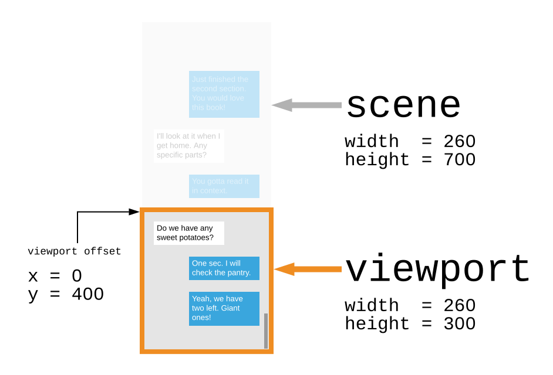

# Frontend - Zoon

---

## Basics

A **Counter** example:

```rust
use zoon::*;

#[static_ref]
fn counter() -> &'static Mutable<i32> {
    Mutable::new(0)
}

fn increment() {
    counter().update(|counter| counter + 1)
}

fn decrement() {
    counter().update(|counter| counter - 1)
}

fn root() -> impl Element {
    Column::new()
        .item(Button::new().label("-").on_press(decrement))
        .item(Text::with_signal(counter().signal()))
        .item(Button::new().label("+").on_press(increment))
}

fn main() {
    start_app("app", root);
}
```

The alternative **Counter** example with a local state:

```rust
use zoon::{*, println};

fn root() -> impl Element {
    println!("I'm different.");

    let (counter, counter_signal) = Mutable::new_and_signal(0);
    let on_press = move |step: i32| *counter.lock_mut() += step;

    Column::new()
        .item(Button::new().label("-").on_press(clone!((on_press) move || on_press(-1))))
        .item_signal(counter_signal)
        .item(Button::new().label("+").on_press(move || on_press(1)))
}

fn main() {
    start_app("app", root);
}
```

### 1. The App Initialization

1. The function `main` is invoked automatically.
1. Zoon's function `start_app` appends the element returned from the `root` function to the element with the id `app`.

    - You can also pass the value `None` instead of `"app"` to mount directly to `body` but it's not recommended.

    - When the `root` function is invoked (_note:_ it's invoked only once), all elements are immediately created and rendered to the browser DOM. (It means, for instance, methods `Column::new()` or `.item(..)` writes to DOM.)

    - Data stored in functions marked by the attribute `#[static_ref]` are lazily initialized on the first call.

### 2. Update

1. The user clicks the decrement button.

1. The function `decrement` is invoked.

1. `counter`'s value is decremented.

1. `counter` has type `Mutable` => it sends its updated value to all associated signals.

1. The new `counter` value is received through a signal and the corresponding text is updated.
    - In the original example, only the content of the `Text` element is changed.
    - In the alternative examples, the `counter` value is automatically transformed to a new `Text` element.

_Notes:_

- Read the excellent [tutorial](https://docs.rs/futures-signals/0.3.22/futures_signals/tutorial/index.html) for `Mutable` and signals in the `futures_signals` crate.
- `zoon::*` reimports most needed types and you can access some of Zoon's dependencies by `zoon::[library]` like `zoon::futures_signals`.
- `clone!` is a type alias for [enclose::enc](https://docs.rs/enclose/1.1.8/enclose/macro.enc.html).
- `static_ref`, `clone!` and other things can be disabled or set by Zoon's [features](https://doc.rust-lang.org/cargo/reference/features.html).

---

## Elements

A **Counter** example part:

```rust
Button::new().label("-").on_press(decrement)
```

We'll look at the `Button` element code (`crates/zoon/src/element/button.rs`). `Button` is a native Zoon element.

You can create custom ones the same way or make similar ones but simpler - it always depends on your requirements.

There are three sections: `Element`, `Abilities` and `Attributes` in `Button`'s code.

**`Element`:**

```rust
use crate::*; // `crate` == `zoon`
use std::{iter, marker::PhantomData};

// ------ ------
//    Element 
// ------ ------

make_flags!(Label, OnPress);

pub struct Button<LabelFlag, OnPressFlag, RE: RawEl> {
    raw_el: RE,
    flags: PhantomData<(LabelFlag, OnPressFlag)>,
}

impl Button<LabelFlagNotSet, OnPressFlagNotSet> {
    pub fn new() -> Self {
        run_once!(|| {
            global_styles()
                .style_group(
                    StyleGroup::new(".button > *")
                        .style("margin-top", "auto")
                        .style("margin-bottom", "auto"),
                )
                // ...
        });
        Self {
            raw_el: RawHtmlEl::<web_sys::HtmlDivElement>::new("div")
                .class("button")
                .attr("role", "button")
                .attr("tabindex", "0")
                .style("cursor", "pointer")
                // ...
            flags: PhantomData,
        }
    }
}

impl<OnPressFlag, RE: RawEl + Into<RawElement>> Element for Button<LabelFlagSet, OnPressFlag, RE> {
    fn into_raw_element(self) -> RawElement {
        self.raw_el.into()
    }
}

impl<LabelFlag, OnPressFlag, RE: RawEl> IntoIterator for Button<LabelFlag, OnPressFlag, RE> {
    // ...
}

impl<LabelFlag, OnPressFlag, RE: RawEl> UpdateRawEl for Button<LabelFlag, OnPressFlag, RE> {
    type RawEl = RE;

    fn update_raw_el(mut self, updater: impl FnOnce(Self::RawEl) -> Self::RawEl) -> Self {
        self.raw_el = updater(self.raw_el);
        self
    }
}
```
- The element has to implement the trait `Element`.
- It's strongly recommended to implement `UpdateRawEl` and `IntoIterator` to allow users to customize the element and use its _abilities_ and to use some Zoon helpers.
- `RawHtmlEl::style` automatically adds vendor prefixes for CSS property names and values where required. E.g. `"user-select"` will be replaced with `"-webkit-user-select"` on Safari and browsers on iOS.
- `make_flags!`, `run_once` and `global_styles` will be explained later.

**`Abilities`:**

```rust
// ------ ------
//   Abilities
// ------ ------

impl<LabelFlag, OnPressFlag, RE: RawEl> Styleable<'_> for Button<LabelFlag, OnPressFlag, RE> {}
impl<LabelFlag, OnPressFlag, RE: RawEl> KeyboardEventAware for Button<LabelFlag, OnPressFlag, RE> {}
// ...
```
Abilities are traits where all functions have a default implementation. Only elements should implement abilities. Example: When you implement `Styleable` for your element, then users can call the `.s(...)` method on your element:

```rust
MyElement::new().s(Padding::new().all(6))
``` 

You can find all built-in abilities in `crates/zoon/src/element/ability.rs`. The `Styleable` ability implementation:

```rust
pub trait Styleable<'a>: UpdateRawEl + Sized {
    fn s(self, style: impl Style<'a>) -> Self {
        self.update_raw_el(|raw_el| {
            raw_el.style_group(style.merge_with_group(StyleGroup::default()))
        })
    }
}
```

**`Attributes`:**

```rust
// ------ ------
//  Attributes
// ------ ------

impl<'a, LabelFlag, OnPressFlag, RE: RawEl> Button<LabelFlag, OnPressFlag, RE> {
    pub fn label(
        mut self,
        label: impl IntoElement<'a> + 'a,
    ) -> Button<LabelFlagSet, OnPressFlag, RE>
    where
        LabelFlag: FlagNotSet,
    {
        self.raw_el = self.raw_el.child(label);
        self.into_type()
    }
    // ...
```

_Note_: Attribute implementations look a bit verbose because of long types and generics but it's a trade-off for the user comfort and safety. Also we will improve it as soon as stable Rust has better support for const generics and other things.

--

`make_flags!(Label, OnPress);` generates code like:
```rust
struct LabelFlagSet;
struct LabelFlagNotSet;
impl zoon::FlagSet for LabelFlagSet {}
impl zoon::FlagNotSet for LabelFlagNotSet {}

struct OnPressFlagSet;
struct OnPressFlagNotSet;
impl zoon::FlagSet for OnPressFlagSet {}
impl zoon::FlagNotSet for OnPressFlagNotSet {}
```

The only purpose of _flags_ is to enforce extra rules by the Rust compiler.

The compiler doesn't allow to call `label` or `label_signal` if the label is already set. The same rule applies for `on_press` handler.

```rust
Button::new()
    .label("-")
    .label("+")
```
fails with
```
error[E0277]: the trait bound `LabelFlagSet: FlagNotSet` is not satisfied
  --> frontend\src\lib.rs:20:14
   |
20 |.label("+"))
   | ^^^^^ the trait `FlagNotSet` is not implemented for `LabelFlagSet`
```

---

## Lifecycle Hooks

**Canvas** example parts:

```rust
use zoon::{web_sys::{CanvasRenderingContext2d, HtmlCanvasElement}, /*...*/ };

#[static_ref]
fn canvas_context() -> &'static Mutable<Option<SendWrapper<CanvasRenderingContext2d>>> {
    Mutable::new(None)
}

fn set_canvas_context(canvas: HtmlCanvasElement) {
    let ctx = canvas
        .get_context("2d")
        .unwrap_throw()
        .unwrap_throw()
        .unchecked_into::<CanvasRenderingContext2d>();
    canvas_context().set(Some(SendWrapper::new(ctx)));
    paint_canvas();
}

fn remove_canvas_context() {
    canvas_context().take();
}

fn canvas() -> impl Element {
    Canvas::new()
        .width(300)
        .height(300)
        .after_insert(set_canvas_context)
        .after_remove(|_| remove_canvas_context())
}
```

- You can call methods (_hooks_) `after_insert` and `after_remove` on all _elements_ implementing the _ability_ `Hookable`.

- Hooks allow you to access the DOM node directly through their function argument. The code calling native DOM APIs may become quite verbose but you have the full power of the crate [web_sys](https://docs.rs/web-sys/) under your hands.

- [SendWrapper](https://docs.rs/send_wrapper/latest/send_wrapper/struct.SendWrapper.html) allows you to store non-`Send` types (e.g. `web_sys` elements) to statics. 
  - _Note:_ The API will be probably revisited once Wasm fully supports multithreading. One idea is to introduce lightweight _actors_ as an alternative to `#[static_ref]` functions. 

The `Hookable` ability / trait:

```rust
pub trait Hookable: UpdateRawEl + Sized {
    fn after_insert(
        self,
        handler: impl FnOnce(<Self::RawEl as RawEl>::DomElement) + 'static,
    ) -> Self {
        self.update_raw_el(|raw_el| raw_el.after_insert(handler))
    }

    fn after_remove(
        self,
        handler: impl FnOnce(<Self::RawEl as RawEl>::DomElement) + 'static,
    ) -> Self {
        self.update_raw_el(|raw_el| raw_el.after_remove(handler))
    }
}
```
and its implementation for `Canvas`:
```rust
impl<WidthFlag, HeightFlag, RE: RawEl> Hookable for Canvas<WidthFlag, HeightFlag, RE> {}
```
- `DomElement` is one of the `web_sys` / DOM elements. It's [web_sys::HtmlCanvasElement](https://docs.rs/web-sys/latest/web_sys/struct.HtmlCanvasElement.html) in this case (as defined in `crates/zoon/src/element/canvas.rs`).

---

## Styles

A **TodoMVC** example part:

```rust
fn new_todo_title() -> impl Element {
    TextInput::new()
        .s(Padding::new().y(19).left(60).right(16))
        .s(Font::new().size(24).color(hsluv!(0, 0, 32.7)))
        .s(Background::new().color(hsluv!(0, 0, 0, 0.3)))
        .s(Shadows::new([Shadow::new()
            .inner()
            .y(-2)
            .blur(1)
            .color(hsluv!(0, 0, 0, 3))]))
        .focus(true)
        .on_change(super::set_new_todo_title)
        .label_hidden("What needs to be done?")
        .placeholder(
            Placeholder::new("What needs to be done?")
                .s(Font::new().italic().color(hsluv!(0, 0, 91.3))),
        )
        .on_key_down_event(|event| event.if_key(Key::Enter, super::add_todo))
        .text_signal(super::new_todo_title().signal_cloned())
}
```

- CSS concepts / events like _focus_, _hover_ and _breakpoints_ are handled directly by Rust / Zoon elements.

- There is no such thing as CSS _margins_ or _selectors_ in Zoon element APIs. Padding and declarative layout (columns, rows, nearby elements, spacing, etc.) are more natural alternatives.

### Global styles

A **Paragraph** element part:

```rust
impl ChoosableTag for Paragraph<EmptyFlagSet, RawHtmlEl<web_sys::HtmlElement>> {
    fn with_tag(tag: Tag) -> Self {
        run_once!(|| {
            global_styles()
                .style_group(StyleGroup::new(".paragraph > *").style_important("display", "inline"))
                .style_group(StyleGroup::new(".paragraph > .align_left").style("float", "left"))
                .style_group(StyleGroup::new(".paragraph > .align_right").style("float", "right"));
        });
        Self {
            raw_el: RawHtmlEl::new(tag.as_str()).class("paragraph"),
            flags: PhantomData,
        }
    }
}
```
- `run_once!` is a Zoon's macro leveraging [std::sync::Once](https://doc.rust-lang.org/std/sync/struct.Once.html).
- `global_styles()` returns `&'static GlobalStyles` with two public methods: `style_group` and `style_group_droppable`.
- Global styles are stored in one dedicated `<style>` element appended to the `<head>`.
- `StyleGroup` selector and styles are validated in the runtime - invalid ones trigger `panic!`.
- Vendor prefixes are automatically attached to CSS property names and values when needed.

### Raw element styles

```rust
fn element_with_raw_styles() -> impl Element {
    El::new().update_raw_el(|raw_el| {
        raw_el
            .style("cursor", "pointer")
            .style_group(
                StyleGroup::new(":hover .icon")
                    .style("display", "block")
            )
    })
}
```
- `raw_el` is either `RawHtmlEl` or `RawSvgEl` with many useful methods including `style` and `style_group`.
- `StyleGroup` selector is prefixed by a unique element _class id_ - e.g. `._13:hover .icon`.
- `StyleGroup`s are stored among the global styles and dropped when the associated element is removed from the DOM.

### Animated styles

_Note_: Zoon Animation API is in development but you can use `Transitions` as a less powerful alternative (`Transitions` are Rust wrappers for [CSS transition](https://developer.mozilla.org/en-US/docs/Web/CSS/transition), explained below).

```rust
fn sidebar() -> impl Element {
    Column::new()
        .s(Width::exact_signal(sidebar_expanded().signal().map_bool(|| 180, || 48)))
        .s(Transitions::new([Transition::width().duration(500)]))
        .s(Clip::both())
        .item(toggle_button())
        .item(menu())
}
```

- Use `Transitions` with an iterator of `Transition` to create basic animations.
- There are some typed properties like `Transition::width()` and `::height()`, but you can use also `::all()` and custom property names with `::property("font-size")`.
- Let us know when you want to add another typed property. [The list of supported properties](https://developer.mozilla.org/en-US/docs/Web/CSS/CSS_animated_properties). 

---
## Color

```rust
.s(Font::new().size(24).color(hsluv!(0, 0, 32.7)))

.s(Font::new().size(30).center().color_signal(
    hovered_signal.map_bool(|| hsluv!(10.5, 37.7, 48.8), || hsluv!(12.2, 34.7, 68.2)),
))

.s(Background::new().color(hsluv!(0, 0, 0, 0.3)))

.s(Shadows::new([
    Shadow::new().inner().y(-2).blur(1).color(hsluv!(0, 0, 0, 3))
]))

.s(Borders::new().top(Border::new().color(hsluv!(0, 0, 91.3))))
```

The most commonly used color code systems are:
- HEX - `#ffff00`, 
- RGB - `rgb(255, 255, 0)` 
- HSL - `hsl(60, 100%, 50%)`

_

However, when you want to:
- create color palettes and themes
- make sure the button is slightly lighter or darker on hover
- make the text more readable

you often need to set saturation and lightness directly. Also it's nice to identify the hue on the first look when you are reading the code. These two conditions basically renders HEX and RGB unusable.

_

But there is also a problem with HSL. Let's compare these two colors:


Are we sure they have the same lightness `50%`? I don't think so. The human eye perceives yellow as brighter than blue. Fortunately there is a color system that takes into account this perception: [HSLuv](https://www.hsluv.org/).


That's why Zoon uses only HSLuv, represented in the code as `hsluv!(h, s, l)` or `hsluv!(h, s, l, a)`, where:
- `h` ;  _hue_  ; 0 - 360
- `s` ;  _saturation_  ; 0 - 100
- `l` ;  _lightness_  ; 0 - 100
- `a` ;  _alpha channel / opacity_ ; 0 (transparent) - 100 (opaque)

The macro `hsluv!` creates an `HSLuv` instance and all color components are checked during compilation.

_Notes/Update_: There is a new color system - [OKLCH](https://oklch.evilmartians.io/). It's similar to `HSLuv` but it should be a bit better. Also a color palette generator together with system-agnostic API could be introduced into Zoon in the nearer future. See the [related issue](https://github.com/MoonZoon/MoonZoon/issues/98).   

<details>
<summary>Other examples why color theory and design in general are difficult</summary>

- The human eye recognizes differences between lighter tones better than between darker tones. This fact is important for creating color palettes.
- Too extreme contrast weakens reading stamina - you shouldn't use pure black and white too often (unless you are creating a special theme for low vision users).
- Relatively many people are at least slightly color blind. It means, for example:
   - Red "Stop button" has to have also a text label.
   - Do you want to show different routes on the map? Use different line styles (e.g. dashed, dottted) instead of different colors.
   - The guy over there maybe doesn't know his T-shirt isn't gray but pink. (It's a typical issue for _deutan color blindness_; ~5% of men.)
   - Pick colors and labels for charts carefully - some charts could become useless for color blind people or when you decide to print them in a gray-scale mode. (HSLuv mode can help here a bit because you can pick colors with different lightness values.) 

</details>

---

## Size

### Units

CSS supports `cm`, `mm`, `in`, `px`, `pt`, `pc`, `em`, `ex`, `ch`, `rem`, `vw`, `vh`, `vmin`, `vmax` and `%`. I'm sure there were reasons for each of them, but let's just use `px`. Zoon may transform pixels to relative CSS units like `rem` or do other computations under the hood to improve accessibility.

### Font Size

Have you ever ever tried to align an element with a text block? An example:


How can we measure or even remove the space above the `Zoon` text? It's an incredibly difficult task because the space is different for each font and it's impossible in CSS without ugly error-prone hacks.

You will be able to resolve it in the future CSS with some new properties, mainly with [leading-trim](https://www.w3.org/TR/css-inline-3/#leading-trim).
One of the comments for the article [Leading-Trim: The Future of Digital Typesetting](https://medium.com/microsoft-design/leading-trim-the-future-of-digital-typesetting-d082d84b202):
> _"This has been a huge annoyance to me for decades! I hope this gets standardized and implemented quickly, thank you for setting this in motion!_" - Tim Etler

_

Typography is one of the most complex parts of (web) design. But we have to somehow simplify it for our purposes.

So I suggest to make the _font size_ an alias for the [_cap height_](https://en.wikipedia.org/wiki/Cap_height). And the _font size_ would be also equal to the line height. It means the code:

```rust
Paragraph::new()
    .s(Font::new().size(40).line_height(40 + 30))
    .content("Moon")
    .content("Zoon")
```

would be rendered as:


--

- Related blog post: [_Font size is useless; let’s fix it_](https://tonsky.me/blog/font-size/) by Nikita Prokopov
- https://caniuse.com/sr_leading-trim-text-edge
- Inspirations for a future MZ polyfill: 
   - https://github.com/MathGeniusJodie/tailwindcss-leading-trim
   - https://seek-oss.github.io/capsize/

---

## Viewport

The **Viewport** example parts:

```rust
#[static_ref]
fn viewport_y() -> &'static Mutable<i32> {
    Mutable::new(0)
}

fn jump_to_top() {
    viewport_y().set(0);
}

fn jump_to_bottom() {
    viewport_y().set(i32::MAX);
}

fn on_viewport_change(_scene: Scene, viewport: Viewport) {
    viewport_y().set(viewport.y());
    // ...
}

fn rectangles() -> impl Element {
    Column::new()
        // ...
        .on_viewport_location_change(on_viewport_change)
        .viewport_y_signal(viewport_y().signal())
        .items(iter::repeat_with(rectangle).take(5))
}
```

The concept of `Scene` + `Viewport` has been "stolen" from the Elm world. Just like the picture below. You can find them in [Elm docs](https://package.elm-lang.org/packages/elm/browser/latest/Browser.Dom).



- `Scene` is the part of an element that contains other elements.

- `Viewport` represents the part of the _Scene_ currently visible by the user. It could be used for scrolling/jumping and to help with writing responsive elements.

- You can set the `Viewport` location in elements that implement the `MutableViewport` ability (e.g. `Row`, `Column` or `El`).

- _Notes_:
   - `Viewport`'s `x` and `y` may be negative while the user is scrolling on the phone.
   - `x` and `y` are automatically clamped. So you can write things like `viewport_y().set(i32::MAX)` and don't be afraid the viewport will be moved outside of the scene.

---

## Built-in libraries / API

### Connection + Task

- `UpMsg` are sent from Zoon to Moon. `DownMsg` in the opposite direction.
- `UpMsg` could be buffered when the Moon server is offline. And `DownMsg` when the Zoon client is automatically reconnecting.
- `UpMsg` are sent in a short-lived _fetch_ request, `DownMsg` are sent in a _server-sent event_ to provide real-time communication.
- A _correlation id_ is automatically generated and sent to the Moon with each request. Moon can send it back with the next `DownMsg` or send a new `CorId`. You can also send an auth token together with the `UpMsg`.
- A _session id_ is automatically generated when the `Connection` is created. Then it's sent with each `UpMsg`. You can use it to simulate standard request-response mechanism.
- `Task::start` or `Task::start_droppable` spawn the given `Future`. (_Note:_ Multithreading isn't supported yet.) 
- See `examples/chat` for the entire code.

```rust
#[static_ref]
fn connection() -> &'static Connection<UpMsg, DownMsg> {
    Connection::new(|DownMsg::MessageReceived(message), _cor_id| {
        messages().lock_mut().push_cloned(message);
        jump_to_bottom();
    })
    // .auth_token_getter(|| AuthToken::new("my_auth_token"))
}

fn send_message() {
    Task::start(async {
        let result = connection()
            .send_up_msg(UpMsg::SendMessage(Message {
                username: username().get_cloned(),
                text: new_message_text().take(),
            }))
            .await;
        match result {
            Ok(cor_id) => println!("Correlation id: {}", cor_id),
            Err(error) => eprintln!("Failed to send message: {:?}", error),
        }
    });
}
```

### Timer
 
- Could be used as a timeout or stopwatch (to set an interval between callback calls).
- `Timer` has methods `new`, `new_immediate`, `once` and `sleep` (async).
- `Timer` is stopped on drop.
- See `examples/timer` for the entire code.

```rust
#[static_ref]
fn timeout() -> &'static Mutable<Option<Timer>> {
    Mutable::new(None)
}

fn timeout_enabled() -> impl Signal<Item = bool> {
    timeout().signal_ref(Option::is_some)
}

fn start_timeout() {
    timeout().set(Some(Timer::once(2_000, stop_timeout)));
}

fn stop_timeout() {
    timeout().take();
}

fn sleep_panel() -> impl Element {
    let (asleep, asleep_signal) = Mutable::new_and_signal(false);
    let sleep = move || {
        Task::start(async move {
            asleep.set_neq(true);
            Timer::sleep(2_000).await;
            asleep.set_neq(false);
        })
    };
    Row::new()
        .s(Spacing::new(20))
        .item("2s Async Sleep")
        .item_signal(asleep_signal.map_bool(
            || El::new().child("zZZ...").left_either(),
            move || start_button(sleep.clone()).right_either(),
        ))
}
```

### Routing

- You just need the struct `Router` and the `route` macro to implement basic routing in your app.
- The callback passed into `Router::new` is called when the url has been changed.
- `#[route("segment_a", "segment_b")]` will be transformed to the url `"/segment_a/segment_b"`.
- Dynamic route segments (aka parameters / arguments) have to implement the trait `RouteSegment` (see the code below for an example). It has been already implemented for basic items like `f64` or `String`.
- Dynamic segment names have to match to the associated enum variant fields. Notice `frequency` in this snippet:
   ```rust
   #[route("report", frequency)]
   Report { frequency: report_page::Frequency },
   ```
- Urls are automatically encoded and decoded (see [encodeURIComponent() on MDN](https://developer.mozilla.org/en-US/docs/Web/JavaScript/Reference/Global_Objects/encodeURIComponent) for more info).
- There are helpers like `routing::back`, `routing::url`, `Router::go` and `Router::replace`.
- Routes are matched against the incoming url path from the first one to the last one. The example of the generated code for matching the route `#[route("report", frequency)]`:
   ```rust
   fn route_0_from_route_segments(segments: &[String]) -> Option<Self> {
       if segments.len() != 2 { None? }
       if segments[0] != "report" { None? }
       Some(Self::ReportWithFrequency {
           frequency: RouteSegment::from_string_segment(&segments[1])?
       })
   }
   ```
- The simplified part of the `examples/pages` below. See the original code to learn how to write "guards", redirect after login, etc.

```rust
// ------ router ------

#[static_ref]
pub fn router() -> &'static Router<Route> {
    Router::new(|route| match route { 
        Some(Route::Report { frequency }) => {
            app::set_page_id(PageId::Report);
            report_page::set_frequency(frequency);
        }
        Some(Route::Calc { operand_a, operator, operand_b }) => {
            app::set_page_id(PageId::Calc);
            calc_page::set_expression(
                calc_page::Expression::new(operand_a, operator, operand_b)
            );
        }
        Some(Route::Root) => {
            app::set_page_id(PageId::Home);
        }
        None => {
            app::set_page_id(PageId::Unknown);
        }
    })
}

// ------ Route ------

#[route]
pub enum Route {
    #[route("report", frequency)]
    Report { frequency: report_page::Frequency },

    #[route("calc", operand_a, operator, operand_b)]
    Calc {
        operand_a: f64,
        operator: String,
        operand_b: f64,
    },

    #[route()]
    Root,
}

//...

impl RouteSegment for Frequency {
    fn from_string_segment(segment: &str) -> Option<Self> {
        match segment {
            DAILY => Some(Frequency::Daily),
            WEEKLY => Some(Frequency::Weekly),
            _ => None,
        }
    }

    fn into_string_segment(self) -> Cow<'static, str> {
        self.as_str().into()
    }
}

```

--

Link handling


All urls starting with `/` are treated as _internal_. It means when you click the link like 
```html
<a href="/something">I'm a link with an internal url</a>
```
then the `click` event will be in most cases fully handled by the Zoon to prevent browser tab reloading.

Exceptions when the link click isn't intercepted even if its `href` starts with `/`:
- The link has the `download` attribute.
- The link has the `target` attribute with the value `_blank`.
- The user holds the key `ctrl`, `meta` or `shift` while clicking.
- The user hasn't clicked by the primary button (left button for right-handed).

### LocalStorage & SessionStorage

```rust
static STORAGE_KEY: &str = "todomvc-zoon";

#[derive(Deserialize, Serialize)]
#[serde(crate = "serde")]
struct Todo {
    id: TodoId,
    title: Mutable<String>,
    completed: Mutable<bool>,
    #[serde(skip)]
    edited_title: Mutable<Option<String>>,
}

pub fn load_todos() {
    if let Some(Ok(todos)) = local_storage().get(STORAGE_KEY) {
        replace_todos(todos);
        println!("Todos loaded");
    }
}

fn save_todos() {
    if let Err(error) = local_storage().insert(STORAGE_KEY, todos()) {
        eprintln!("Saving todos failed: {:?}", error);
    }
}
```

- All items implementing [serde](https://serde.rs/) / [serde-lite](https://crates.io/crates/serde-lite)'s `Deserialize` and `Serialize` can be stored in the local or session storage.
- `#[serde(crate = "serde")]` is needed because Rust macros often doesn't work as expected when reimported (from `zoon` in this case).
- See `examples/todomvc` or `crates/zoon/src/web_storage.rs` for more info.

---

## SEO

- When the request comes from a robot (e.g. _Googlebot_), then MoonZoon renders elements to a HTML string and sends it back to the robot. (It's basically a limited _Server-Side Rendering_ / [_Dynamic Rendering_](https://developers.google.com/search/docs/advanced/javascript/dynamic-rendering).) [Not implemented yet]

- You can configure the default page title, _The Open Graph Metadata_ and other things in the Moon app.
    ```rust
    async fn frontend() -> Frontend {
        Frontend::new().title("Chat example").append_to_head(
            "
            <style>
                html {
                    background-color: black;
                }
            </style>",
        )
    }
    ```

---

## FAQ
1. _"Why another frontend framework? Are you mad??"_
   - Because I have some problems with the existing ones. Some examples:

        <details>
        <summary>Problems with existing frontend frameworks</summary>

        - I'm not brave enough to write apps and merge pull requests written in a dynamic language.
        - I'm tired of configuring Webpack-like bundlers and fixing bugs caused by incorrectly typed JS libraries to Typescript.
        - I want to share code between the client and server and I want good SEO and I don't want to switch context (language, ecosystem, best practices, etc.) while I'm writing both frontend and server.
        - I don't want to read the entire stackoverflow.com and MDN docs to find out why my image has incorrect size on the website.
        - I don't want to be afraid to refactor styles.
        - I don't want to write backend code instead of the frontend code just because the frontend is too slow.
        - Who have time and energy to properly learn, write and constantly think about accessibility and write unit tests that take into account weird things like `null` or `undefined`?
        - I'm tired of searching for missing semicolons and brackets in HTML and CSS when it silently fails in the runtime.
        - I don't want to choose a CSS framework, bundler, state manager, router, bundler plugins, CSS preprocessor plugins, test framework and debug their incompatibilities and learn new apis everytime I want to create a new web project.
        - Why the layout is broken on iPhone, the app crashes on Safari, it's slow on Chrome and scrollbars don't work on Windows? 
        - I just want to send a message to a server. I don't want to handle retrying, set headers, set timeout, correctly serialize everything, handle errors by their numbers, constantly think about cookies, domains, protocols, XSS, CSRF, etc.
        - What about SEO?
        - Should I use standard routing, hash routing, query parameters, custom base paths? Is everything correctly encoded and decoded?
        - etc.
        
        </details>
        
1. _"How are we taking care of animations?"_ (by None on [chat](https://discord.gg/eGduTxK2Es))
   - The API for advanced animations is in development. 
   - Inspiration:
      - [react-spring](https://www.react-spring.io/)
      - [Framer Motion](https://www.framer.com/motion/)
      - [React UseGesture](https://use-gesture.netlify.app/)
      - [elm-animator](https://korban.net/posts/elm/2020-04-07-using-elm-animator-with-elm-ui/)
      - "svelte has really good set of animation examples in their tutorial site. Incase it can help somehow [section 9 -11]" (by Ruman on [chat](https://discord.gg/eGduTxK2Es))
      - [rust-dominator/examples/animation](https://github.com/Pauan/rust-dominator/blob/master/examples/animation/src/lib.rs)

1. _"Hey Martin, what about [Seed](https://seed-rs.org/)?"_
   - Zoon and Seed have very different features and goals. I no longer actively maintain Seed.

1. _"How do I get a standalone html+wasm output? I previously used Yew + Trunk."_ (by `@Noir` on [chat](https://discord.gg/eGduTxK2Es))

    ```sh
    mzoon build --release --frontend-dist netlify
    ```
