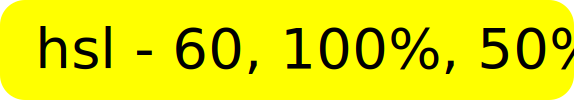
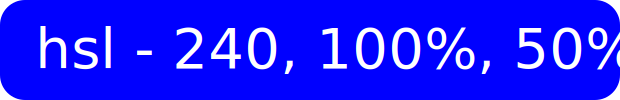
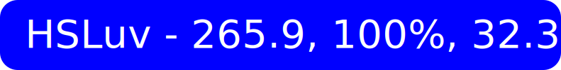
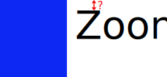

# Frontend - Zoon

---

## Basics

The **Counter** example:

```rust
#![no_std]

use zoon::*;

blocks!{

    #[s_var]
    fn counter() -> SVar<i32> {
        0
    }

    /* Alternative without `SVar` (`i32` is automatically wrapped in `SVar`):
    #[s_var]
    fn counter() -> i32 {
        0
    }
    */

    #[update]
    fn increment() {
        counter().update(|counter| counter + 1);
    }

    #[update]
    fn decrement() {
        counter().update(|counter| counter - 1);
    }

    #[cmp]
    fn root() -> Cmp {
        col![
            button![button::on_press(decrement), "-"],
            counter().inner(),
            button![button::on_press(increment), "+"],
        ]
    }

    /* Non-macro element alternative:
    #[cmp]
    fn root() -> Cmp {
        Column::new()
            .item(Button::new().on_press(decrement).label("-"))
            .item(counter().inner()),
            .item(Button::new().on_press(increment).label("+"))
    }
    */
}

#[wasm_bindgen(start)]
pub fn start() {
    start!()
}
```

### 1. The App Initialization

1. The function `start` is invoked automatically from the Javascript code.
1. Zoon's macro `start!` is called to start the app.
1. The function `counter` is invoked and its default value `0` is stored in the Zoon's internal storage.
1. The function `root` is invoked and its value is stored in the Zoon's internal storage, too.
1. The `counter` function was called in the `root`'s body - it means `root` has subscribed to `counter` changes and it will be automatically invoked on each `counter` change. 

### 2. The First Render

1. Zoon waits until the browser is ready for rendering.
1. The entire `#[cmp]` (_component_) tree (only `root` in this example) is rendered to the predefined location in the browser DOM.

### 3. Update

1. The user clicks the decrement button.
1. The function `decrement` is invoked.
1. `counter`'s value is decremented. 
   - _Note_: The function `counter` returns `SVar<i32>` (_**S**tatic **Var**iable_). _SVar_ is basically a copyable wrapper for a reference to the Zoon's internal storage.
1. `root` component listens for `counter` changes - `root` is automatically recomputed and Zoon waits for the browser to allow rendering.
1. Components dependent on changed data are effectively rerendered in the DOM. 
   - _Note_: When a parent component has to be rerendered, it doesn't mean that all its descendants have to be rerendered as well - each `#[cmp]` block may depend on different variables.

---

## Components

The **Counters** example parts:

```rust
#[cmp]
fn click_me_button() -> Cmp {
    let title = cmp_var(|| "Click me!".to_owned());
    let click_count = cmp_var(|| 0);
    row![
        button![
            title.inner(),
            button::on_press(move || {
                click_count.update(|count| count + 1);
                title.set(format!("Clicked {}x", click_count.inner()));
            }),
        ],
    ]
} 
```

- _Components_ (e.g. `click_me_button`) are groups of _Elements_ (e.g. `Row`, `Button`).
- You can create a `CmpVar` (_**C**o**mp**onent **Var**iable_) inside them, defined by `cmp_var` with the closure that returns the default value. `CmpVar` represents a "local state" and its value is preserved between component calls. _Components_ are automatically recomputed on `CmpVar` change.
- _Components_ accept only _Variables_ like `SVar`, `Cache` or `CmpVar` as arguments.

```rust
#[cmp]
fn counter_count() -> Cmp {
    el![
        format!("Counters: {}", super::counter_count().inner())
    ]
}
```

- _Components_ may depend on other _Variables_ like `SVar` or `Cache`.
- The _component_ above is automatically recomputed on `counter_count` change, because `counter_count()` definition is marked by the `#[cache]` attribute.

```rust
#[cmp]
fn counter_row() -> Cmp {
    row![
        (0..super::column_count().inner()).map(|_| counter())
    ]
}

#[cmp]
fn counter() -> Cmp {
    counter![]
}
```

- `counter` component instances above are NOT recomputed on `column_count` change. Only new `counter` instances are created or old ones removed according to the new `column_count` value.
- A `counter` instance is recomputed only when its `Counter` element (created by `counter!` macro) requires rerendering.
- `CmpVar`s, elements and nested components are removed (aka _dropped_) on their parent component drop. 

## Elements

The **Counters** example parts:

```rust
// counters/frontend/src/app/cmp.rs 

#[cmp]
fn row_counter() -> Cmp {
    row![
        "Rows:",
        counter![
            super::row_count().inner(),
            counter::on_change(super::set_row_count),
            counter::step(5),
        ]
    ]
}
```


```rust
// counters/frontend/src/app/cmp/element/counter.rs

use zoon::*;
use std::rc::Rc;
use enclose::enc;

// ------ ------
//    Element 
// ------ ------

element_macro!(counter, Counter::default());

#[derive(Default)]
pub struct Counter {
    value: Option<i32>,
    on_change: Option<OnChange>,
    step: Option<i32>,
}

impl Element for Counter {
    #[render]
    fn render(&mut self, rcx: RenderContext) {
        let on_change = self.on_change.take().map(|on_change| on_change.0);
        let step = self.step.unwrap_or(1);
        
        let value = el_var(|| 0);
        if let Some(required_value) = self.value {
            value.set(required_value);
        }
        
        let update_value = move |delta: i32| {
            value.update(|value| value + delta);
            if let Some(on_change) = on_change.clone() {
                on_change(value.inner());
            }
            rcx.rerender();
        };
        row![
            button![
                button::on_press(enc!((update_value) move || update_value(-step))),
                "-"
            ],
            el![value.inner()],
            button![
                button::on_press(move || update_value(step)), 
                 "+"
            ],
        ].render(rcx);
    }
}

// ------ ------
//  Attributes 
// ------ ------

// ------ i32 ------

impl ApplyToElement<Counter> for i32 {
    fn apply_to_element(self, counter: &mut Counter) {
        counter.value = Some(self);
    }
}

// ------ counter::on_change(...) -------

pub struct OnChange(Rc<dyn Fn(i32)>);

pub fn on_change(on_change: impl FnOnce(i32) + Clone + 'static) -> OnChange {
    OnChange(Rc::new(move |value| on_change.clone()(value)))
}

impl ApplyToElement<Counter> for OnChange {
    fn apply_to_element(self, counter: &mut Counter) {
        counter.on_change = Some(self);
    }
}

// ------ counter::step(...) -------

pub struct Step(i32);

pub fn step(step: i32) -> Step {
    Step(step)
}

impl ApplyToElement<Counter> for Step {
    fn apply_to_element(self, counter: &mut Counter) {
        counter.step = Some(self.0);
    }
}
```

- `ElVar` (_**El**ement **Var**iable_, defined by `el_var`) is very similar to `CmpVar`, but it does NOT trigger parent component rerendering on change. You have to call `rcx.rerender()` when needed, however keep in mind you can accidentally create an infinite loop if the call is done directly in the `render` method.

- "Native" elements like `Button (button!)`, `El (el!)` or `Column (col!)` are defined in the same way.

- We will write an "_element library_" for Zoon or our apps instead of a "_component library_" (as is common in other frameworks terminology). 

- All elements should be _accessible_ by default.

A non-macro alternative:

```rust
#[cmp]
fn row_counter() -> Cmp {
    Row::new()
        .item("Rows:")
        .item(Counter::new()
            .value(super::row_count().inner())
            .on_change(super::set_row_count)
            .step(5)
        )
}
```

```rust
#[derive(Default)]
pub struct Counter {
    value: Option<i32>,
    on_change: Option<Rc<dyn Fn(i32)>>,
    step: Option<i32>,
}

impl Element for Counter {
    #[render]
    fn render(&mut self, rcx: RenderContext) {
        let on_change = self.on_change.take().map(|on_change| on_change);
        ...
    }
}

impl Counter {
    pub fn value(mut self, value: i32) -> Self {
        self.value = Some(value);
        self
    }

    pub fn on_change(mut self, on_change: impl FnOnce(i32) + Clone + 'static) -> Self {
        self.on_change = Some(Rc::new(move |value| on_change.clone()(value)));
        self
    }

    pub fn step(mut self, step: i32) -> Self {
        self.step = Some(step);
        self
    }
}
```

## Styles

The **Todos** example part:

```rust
    #[cmp]
    fn todo(todo: Var<super::Todo>) -> Cmp {
        let selected = Some(todo) == super::selected_todo();
        let checkbox_id = cmp_var(ElementId::new);
        let row_hovered = cmp_var(|| false);
        row![
            font::size(24),
            padding!(15),
            spacing(10),
            on_hovered_change(row_hovered.setter()),
            todo_checkbox(checkbox_id, todo),
            selected.not().then(|| todo_label(checkbox_id, todo)),
            selected.then(selected_todo_title),
            row_hovered.inner().then(|| remove_todo_button(todo)),
        ]
    }
```

- CSS concepts / events like _focus_, _hover_ and _breakpoints_ are handled directly by Rust / Zoon _elements_.

- There is no such thing as CSS _margins_ or _selectors_. Padding and element / component nesting are more natural alternatives.

---
## Color

```rust
background::color(hsl(0, 0, 100)),
border::shadow!(
    shadow::offsetXY(0, 2),
    shadow::size(0),
    shadow::blur(4),
    shadow::color(hsla(0, 0, 0, 20)),
),
font::color(if hovered().inner() { hsl(12, 35, 60) } else { hsl(10, 30, 50) }),
```

The most commonly used color code systems are:
- HEX - `#ffff00`, 
- RGB - `rgb(255, 255, 0)` 
- HSL - `hsl(60, 100%, 50%)`

_

However when you want to:
- create color palettes and themes
- make sure the button is slightly lighter or darker on hover
- make the text more readable

you often need to set saturation and lightness directly. Also it's nice to identify the hue on the first look when you are reading the code. These two conditions basically renders HEX and RGB unusable.

_

But there is also a problem with HSL. Let's compare these two colors:




Are we sure they have the same lightness `50%`? I don't think so. The human eye perceives yellow as brighter than blue. Fortunately there is a color system that takes into account this perception: [HSLuv](https://www.hsluv.org/).




That's why Zoon uses only HSLuv, represented in the code as `hsl(h, s, l)` or `hsla(h, s, l, a)`, where:
- `h` ;  _hue_  ; 0 - 360
- `s` ;  _saturation_  ; 0 - 100
- `l` ;  _lightness_  ; 0 - 100
- `a` ;  _alpha channel / opacity_ ; 0 (transparent) - 100 (opaque)

<details>
<summary>Other examples why color theory and design in general are difficult</summary>

- The human eye recognizes differences between lighter tones better than between darker tones. This fact is important for creating color palettes.
- Too extreme contrast weakens reading stamina - you shouldn't use pure black and white too often (unless you are creating a special theme for low vision users).
- Relatively many people are at least slightly color blind. It means, for example:
   - Red "Stop button" has to have also a text label.
   - Do you want to show different routes on the map? Use rather different line styles (e.g. dashed, dottted) instead of different colors.
   - The guy over there maybe doesn't know his T-shirt isn't gray but pink. (It's a typical issue for _deutan color blindness_; ~5% of men.)
   - Pick colors and labels for charts carefully - some charts could become useless for color blind people or when you decide to print them in a gray-scale mode. (HSLuv mode can help here a bit because you can pick colors with different lightness values.) 

</details>

---

## Size

### Units

CSS supports `cm`, `mm`, `in`, `px`, `pt`, `pc`, `em`, `ex`, `ch`, `rem`, `vw`, `vh`, `vmin`, `vmax` and `%`. I'm sure there were reasons for each of them, but let's just use `px`. Zoon may transform pixels to relative CSS units like `rem` or do other computations under the hood to improve accessibility.

### Font Size

Have you ever ever tried to align an element with a text block? An example:



How we can measure or even remove the space above the `Zoon` text? It's an incredibly difficult task because the space is different for each font and it's impossible in CSS without error-prone ugly hacks.

You will be able to resolve it in the future CSS with some new properties, mainly with [leading-trim](https://www.w3.org/TR/css-inline-3/#leading-trim). 
One of the comments for the article [Leading-Trim: The Future of Digital Typesetting](https://medium.com/microsoft-design/leading-trim-the-future-of-digital-typesetting-d082d84b202):
> _"This has been a huge annoyance to me for decades! I hope this gets standardized and implemented quickly, thank you for setting this in motion!_" - Tim Etler

_

Typography is one of the most complex parts of (web) design. But we have to somehow simplify it for our purposes. 

So I suggest to make the _font size_ an alias for the [_cap height_](https://en.wikipedia.org/wiki/Cap_height). And the _font size_ would be also equal to the line height. It means the code:

```rust
paragraph![
    font::size(40),
    spacing(30),
    "Moon",
    "Zoon",
]
```

would be rendered as:


---

## View & Viewport

The **Time Tracker** example part:

```rust
    #[cmp]
    fn root() -> Cmp {
        view![
            viewport::on_width_change(super::update_viewport_width),
            on_click(super::view_clicked),
            col![
                header(),
                menu_panel(),
                page(),
            ]
        ]
    }
```

- `view` represents the root container for the web page.
- `viewport` represents a part of the _view_ currently visible by the user. It could be used for scrolling and to help with writing responsive elements.
- The _view/viewport_ concept will be probably used for scrollable elements, too.  

---

## Built-in libraries / API
- They will be probably written as standalone crates or they'll need to be activated by feature flags.

### Timer
 
- Could be used as a timeout or stopwatch (to set an interval between callback calls). 
- See `examples/timer` for the entire code.

```rust
    #[s_var]
    fn timeout() -> SVar<Option<Timer>> {
        None
    }

    #[update]
    fn start_timeout() {
        timeout().set(Some(Timer::new(2_000, stop_timeout)));
    }

    #[update]
    fn stop_timeout() {
        timeout().set(None);
    }
```

### Connection

- `UpMsg` are sent from Zoon to Moon. `DownMsg` in the opposite direction.
- `UpMsg` could be buffered when the Moon (server) is offline. And `DownMsg` when the Zoon (client) is automatically reconnecting.
- `UpMsg` are sent in a short-lived _fetch_ request, `DownMsg` are sent in a _server-sent event_  to provide real-time communication.
- A _correlation id_ is automatically generated and sent to the Moon with each request. Moon sends it back. You can also send a token together with the `UpMsg`. 
- See `examples/chat` for the entire code.

```rust
    #[s_var]
    fn connection() -> SVar<Connection<UpMsg, DownMsg>> {
        Connection::new(|down_msg, _| {
            if let DownMsg::MessageReceived(message) = down_msg {
                ...
            }
        })
    }

    #[update]
    fn send_message() {
        connection().use_ref(|connection| {
            connection.send_up_msg(UpMsg::SendMessage(...), None);
        });
    }
```

### Routing

- An example with the nested route `admin::Route`.
- See `examples/pages` for the entire code.

```rust
    #[route]
    enum Route {
        #[route("admin", ..)]
        Admin(admin::Route),
        #[route()]
        Root,
        Unknown,
    }
```

_

- A more complete example with _guards_ and Zoon's function `url()`. 
- See `examples/time_tracker` for the entire code.

```rust

    #[route]
    enum Route {
        #[route("login")]
        #[before_route(before_login_route)]
        Login,

        #[route("clients_and_projects")]
        #[before_route(before_protected_route)]
        ClientsAndProjects,

        #[route()]
        Home,

        #[before_route(before_unknown_route)]
        Unknown,
    }

    fn before_login_route(route: Route) -> Route {
        if user().map(Option::is_none) {
            return route
        }
        Route::home()
    }

    fn before_protected_route(route: Route) -> Route {
        if user().map(Option::is_some) {
            return route
        }
        Route::login()
    }

    fn before_unknown_route(route: Route) -> Route {
        Route::home()
    }

    #[cache]
    fn route() -> Cache<Route> {
        url().map(Route::from)
    }

    #[update]
    fn set_route(route: Route) {
        url().set(Url::from(route))
    }
```

---

## SEO

- When the request comes from a robot (e.g. _Googlebot_), then MoonZoon renders elements to a HTML string and sends it back to the robot. (It's basically a limited _Server-Side Rendering_.)  

- You'll be able to configure the default page title, _The Open Graph Metadata_ and other things in the Moon app. The example (draft API design):
    ```rust
    async fn frontend() -> Frontend {
        Frontend::new().title("Time Tracker example")
    }
    ```

---

## FAQ
1. _"Why another frontend framework? Are you mad??"_
   - Because I have some problems with the existing ones. Some examples:

        <details>
        <summary>Problems with existing frontend frameworks</summary>

        - I'm not brave enough to write apps and merge pull requests written in a dynamic language.
        - I'm tired of configuring Webpack-like bundlers and fixing bugs caused by incorrectly typed JS libraries to Typescript.
        - I want to share code between the client and server and I want server-side rendering and I don't want to switch context (language, ecosystem, best practices, etc.) while I'm writing both frontend and server.
        - I don't want to read the entire stackoverflow.com and MDN docs to find out why my image on the website has incorrect size.
        - I don't want to be afraid to refactor styles.
        - I don't want to write code on the backend instead on the frontend because frontend is just too slow.
        - Who have time and energy to properly learn, write and constantly think about accessibility and write unit tests that take into account weird things like `null` or `undefined`?
        - I'm tired of searching for missing semicolons and brackets in HTML and CSS when it silently fails in the runtime.
        - I don't want to choose a CSS framework, bundler, state manager, router, bundler plugins, CSS preprocessor plugins, test framework and debug their incompatibilities and learn new apis everytime I want to create a new web project.
        - Why the layout is broken on iPhone, the app crashes on Safari, it's slow on Chrome and scrollbars don't work on Windows? 
        - I just want to send a message to a server. I don't want to handle retrying, set headers, set timeout, correctly serialize everything, handle errors by their numbers, constantly think about cookies, domains, protocols, XSS, CSRF, etc.
        - What about SEO?
        - Should I use standard routing, hash routing, query parameters, custom base paths? Is everything correctly encoded and decoded?
        - etc.
        
        </details>
        
1. _"How are we taking care of animations?"_ (by None on [chat](https://discord.gg/eGduTxK2Es))
   - The API for animations haven't been designed yet. We'll probably focus on it once we have a proof-of-concept of the basic MoonZoon features.
   - Inspiration:
      - [react-spring](https://www.react-spring.io/)
      - [Framer Motion](https://www.framer.com/motion/)
      - [React UseGesture](https://use-gesture.netlify.app/)
      - [elm-animator](https://korban.net/posts/elm/2020-04-07-using-elm-animator-with-elm-ui/)
      - "svelte has really good set of animation examples in their tutorial site. Incase it can help somehow [section 9 -11]" (by Ruman on [chat](https://discord.gg/eGduTxK2Es))

1. _"Hey Martin, what about [Seed](https://seed-rs.org/)?"_
   - Zoon and Seed have very different features and goals. I assume we will be able to implement some interesting features inspired by Zoon in Seed, if needed. I'll maintain Seed as usual.
