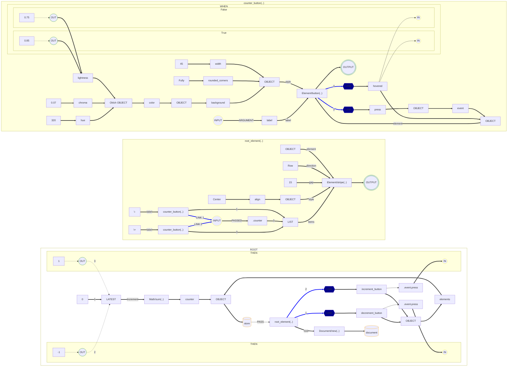

```mermaid
flowchart LR
    classDef root_variable_class stroke:Orange
    classDef function_input_class stroke:Yellow
    classDef function_output_class stroke:Green
    classDef link_class fill:DarkBlue

    subgraph graph_root["ROOT"]
        direction LR
        style graph_root fill:transparent

        VAR_store__61[("store")]:::root_variable_class
        OBJ__67["OBJECT"]

        OBJ__67 ==> VAR_store__61

        VAR_elements__1["elements"]
        OBJ__2["OBJECT"]
        VAR_decrement_button__3["decrement_button"]
        VAR_increment_button__4["increment_button"]
        LIN__5{{"LINK"}}:::link_class
        LIN__6{{"LINK"}}:::link_class

        LIN__5 ==> VAR_decrement_button__3
        VAR_decrement_button__3 ==> OBJ__2
        LIN__6 ==> VAR_increment_button__4
        VAR_increment_button__4 ==> OBJ__2
        OBJ__2 ==> VAR_elements__1
        VAR_elements__1 ==> OBJ__67

        VAR_counter__7["counter"]
        LATEST__8["LATEST"]
        NUM_0__9["0"]
        GET_elements.decrement_button.event.press__10[".event.press"]   
        GET_elements.increment_button.event.press__11[".event.press"]
        CALL_Math_sum__16["Math/sum(..)"]

        subgraph THEN__68["THEN"]
            THEN_IN__71(("IN")):::function_input_class
            NUM_minus_1__14["-1"]
            THEN_OUT__72(("OUT")):::function_output_class

            NUM_minus_1__14 .-> THEN_OUT__72
        end

        subgraph THEN__70["THEN"]
            THEN_IN__73(("IN")):::function_input_class
            NUM_1__15["1"]
            THEN_OUT__74(("OUT")):::function_output_class

            NUM_1__15 .-> THEN_OUT__74
        end

        GET_elements.decrement_button.event.press__10 ==> THEN_IN__71
        GET_elements.increment_button.event.press__11 ==> THEN_IN__73

        NUM_0__9 ==> |"1"| LATEST__8
        THEN_OUT__72 .-> |"2"| LATEST__8
        THEN_OUT__74 .-> |"3"| LATEST__8
        LATEST__8 ==> |"Increment"| CALL_Math_sum__16
        CALL_Math_sum__16 ==> VAR_counter__7
        VAR_counter__7 ==> OBJ__67
        VAR_decrement_button__3 --> GET_elements.decrement_button.event.press__10
        VAR_increment_button__4 --> GET_elements.increment_button.event.press__11

        VAR_document__17[("document")]:::root_variable_class
        CALL_Document_new__18["Document/new(..)"]
        CALL_root_element__19["root_element(..)"]

        VAR_store__61 --> |"PASS"| CALL_root_element__19
        CALL_root_element__19 ==> |"root"| CALL_Document_new__18
        CALL_Document_new__18 ==> VAR_document__17

        CALL_root_element__19 ==> |"1"| LIN__5
        CALL_root_element__19 ==> |"2"| LIN__6

        linkStyle 22,23 stroke:Blue;
    end

    subgraph FUNCTION_root_element__20["root_element(..)"]
        direction LR
        INPUT__62(("INPUT")):::function_input_class
        OUTPUT__47((("OUTPUT"))):::function_output_class

        GET_PASSED.counter__66[".counter"]

        INPUT__62 ==> |"PASSED"| GET_PASSED.counter__66

        CALL_Element_stripe__21["Element/stripe(..)"]
        OBJ__22["OBJECT"]
        TAG_Row__23["Row"]
        NUM_15__24["15"]
        OBJ__25["OBJECT"]
        VAR_align__26["align"]
        TAG_Center__27["Center"]
        LIST__28["LIST"]
        CALL_counter_button__29["counter_button(..)"]
        CALL_counter_button__30["counter_button(..)"]
        TXT_minus__31["\-"]
        TXT_plus__32["\+"]

        OBJ__22 ==> |"element"| CALL_Element_stripe__21
        TAG_Row__23 ==> |"direction"| CALL_Element_stripe__21
        NUM_15__24 ==> |"gap"| CALL_Element_stripe__21
        OBJ__25 ==> |"style"| CALL_Element_stripe__21
        LIST__28 ==> |"items"| CALL_Element_stripe__21

        VAR_align__26 ==> OBJ__25
        TAG_Center__27 ==> VAR_align__26

        TXT_minus__31 ==> |"label"| CALL_counter_button__29
        TXT_plus__32 ==> |"label"| CALL_counter_button__30

        CALL_counter_button__29 ==> |"1"| LIST__28
        GET_PASSED.counter__66 ==> |"2"| LIST__28
        CALL_counter_button__30 ==> |"3"| LIST__28

        CALL_counter_button__29 ==> |"LINK 1"| INPUT__62
        CALL_counter_button__30 ==> |"LINK 2"| INPUT__62

        CALL_Element_stripe__21 ==> OUTPUT__47

        linkStyle 37,38 stroke:Blue;
    end

    subgraph FUNCTION_counter_button__33["counter_button(..)"]
        direction LR
        INPUT__64(("INPUT")):::function_input_class
        OUTPUT__49((("OUTPUT"))):::function_output_class

        CALL_Element_button__33["Element/button(..)"]
        
        OBJECT__34["OBJECT"]
        VAR_event__35["event"]
        OBJECT__36["OBJECT"]
        VAR_press__37["press"]
        LIN__38{{"LINK"}}:::link_class
        VAR_hovered__39["hovered"]
        LIN__40{{"LINK"}}:::link_class

        CALL_Element_button__33 ==> |"3"| LIN__38
        CALL_Element_button__33 ==> |"4"| LIN__40

        OBJECT__41["OBJECT"]
        VAR_width__43["width"]
        VAR_rounded_corners__44["rounded_corners"]
        VAR_background__45["background"]
        ARG_label__46["label"]

        NUM_45__47["45"]
        TAG_Fully_48["Fully"]
        OBJECT__49["OBJECT"]
        VAR_color__50["color"]
        OBJECT_Oklch__51["Oklch OBJECT"]
        VAR_lightness__52["lightness"]
        VAR_chroma__53["chroma"]
        VAR_hue__54["hue"]
        NUM_0.07__55["0.07"]
        NUM_320__56["320"]

        subgraph WHEN__75["WHEN"]
            subgraph ARM_true__76["True"]
                ARM_IN__82(("IN")):::function_input_class
                NUM_0.85__61["0.85"]
                ARM_OUT__83(("OUT")):::function_output_class

                NUM_0.85__61 .-> ARM_OUT__83
            end

            subgraph ARM_true__86["False"]
                ARM_IN__84(("IN")):::function_input_class
                NUM_0.75__62["0.75"]
                ARM_OUT__85(("OUT")):::function_output_class

                NUM_0.75__62 .-> ARM_OUT__85
            end
        end

        INPUT__64 ==> |"ARGUMENT"| ARG_label__46

        OBJECT__34 ==> |"element"| CALL_Element_button__33
        VAR_event__35 ==> OBJECT__34
        OBJECT__36 ==> VAR_event__35
        VAR_press__37 ==> OBJECT__36
        LIN__38 ==> VAR_press__37
        VAR_hovered__39 ==> OBJECT__34
        LIN__40 ==> VAR_hovered__39

        OBJECT__41 ==> |"style"| CALL_Element_button__33
        VAR_width__43 ==> OBJECT__41
        VAR_rounded_corners__44 ==> OBJECT__41
        VAR_background__45 ==> OBJECT__41

        NUM_45__47 ==> VAR_width__43
        TAG_Fully_48 ==> VAR_rounded_corners__44
        OBJECT__49 ==> VAR_background__45
        VAR_color__50 ==> OBJECT__49
        OBJECT_Oklch__51 ==> VAR_color__50
        VAR_lightness__52 ==> OBJECT_Oklch__51
        VAR_chroma__53 ==> OBJECT_Oklch__51
        VAR_hue__54 ==> OBJECT_Oklch__51
        NUM_0.07__55 ==> VAR_chroma__53
        NUM_320__56 ==> VAR_hue__54

        VAR_hovered__39 --> ARM_IN__82
        VAR_hovered__39 --> ARM_IN__84
        ARM_OUT__83 ==> VAR_lightness__52
        ARM_OUT__85 ==> VAR_lightness__52

        ARG_label__46 ==> |"label"| CALL_Element_button__33

        CALL_Element_button__33 ==> OUTPUT__49

        linkStyle 40,41 stroke:Blue;
    end
```
