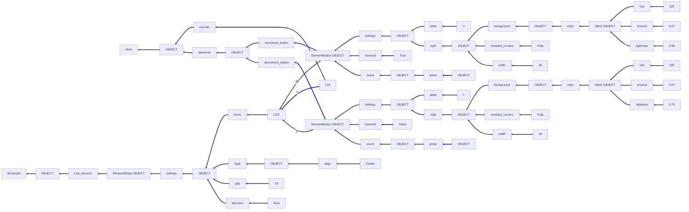

```mermaid
flowchart RL
    classDef root_variable_class stroke:Orange

    VAR_store__0["store"]:::root_variable_class
    OBJECT__1["OBJECT"]
    VAR_elements__2["elements"]
    OBJECT__3["OBJECT"]
    VAR_decrement_button__4["decrement_button"]
    VAR_increment_button__6["increment_button"]
    counter__8["counter"]
    NUM_123__9["123"]
    
    OBJECT__1 ==> VAR_store__0
    VAR_elements__2 ==> OBJECT__1
    OBJECT__3 ==> VAR_elements__2
    VAR_decrement_button__4 ==> OBJECT__3
    VAR_increment_button__6 ==> OBJECT__3
    counter__8 ==> OBJECT__1
    NUM_123__9 ==> counter__8
    %% ^ edge 6
    
    document__-1["document"]:::root_variable_class
    OBJECT__10["OBJECT"]
    VAR_root_element__11["root_element"]
    VAR_ElementStripe_OBJECT__12["ElementStripe OBJECT"]
    VAR_settings__15["settings"]
    OBJECT__16["OBJECT"]
    VAR_direction__17["direction"]
    TAG_Row__18["Row"]
    VAR_gap__19["gap"]
    NUM_15__20["15"]
    VAR_style__21["style"]
    OBJECT__22["OBJECT"]
    VAR_align__23["align"]
    TAG_Center__24["Center"]
    VAR_items__25["items"]
    LIST__26["LIST"]
                            
    OBJECT__10 ==> document__-1
    VAR_root_element__11 ==> OBJECT__10
    VAR_ElementStripe_OBJECT__12 ==> VAR_root_element__11
    VAR_settings__15 ==> VAR_ElementStripe_OBJECT__12
    OBJECT__16 ==> VAR_settings__15
    VAR_direction__17 ==> OBJECT__16
    TAG_Row__18 ==> VAR_direction__17
    VAR_gap__19 ==> OBJECT__16
    NUM_15__20 ==> VAR_gap__19
    VAR_style__21 ==> OBJECT__16
    OBJECT__22 ==> VAR_style__21
    VAR_align__23 ==> OBJECT__22
    TAG_Center__24 ==> VAR_align__23
    VAR_items__25 ==> OBJECT__16
    LIST__26 ==> VAR_items__25
    %% ^ edge 21

    VAR_ElementButton_OBJECT__26["ElementButton OBJECT"]
    VAR_event__49["event"]
    OBJECT__50["OBJECT"]
    VAR_press__51["press"]
    OBJECT__52["OBJECT"]
    VAR_hovered__53["hovered"]
    TAG_False__54["False"]
    VAR_settings__29["settings"]
    OBJECT__30["OBJECT"]
    VAR_style__31["style"]
    OBJECT__32["OBJECT"]
    VAR_width__33["width"]
    NUM_45__34["45"]
    VAR_rounded_corners__35["rounded_corners"]
    TAG_Fully__36["Fully"]
    VAR_background__37["background"]
    OBJECT__38["OBJECT"]
    VAR_color__39["color"]
    OBJECT_Oklch__40["Oklch OBJECT"]
    VAR_lightness__41["lightness"]
    NUM_0.75__42["0.75"]
    VAR_chroma__43["chroma"]
    NUM_0.07__44["0.07"]
    VAR_hue__45["hue"]
    NUM_320__46["320"]
    VAR_label__47["label"]
    TXT_minus__48["\-"]

    %% Ref
    VAR_ElementButton_OBJECT__26 ==> VAR_decrement_button__4
    VAR_ElementButton_OBJECT__26 ==> |"1"| LIST__26
    VAR_event__49 ==> VAR_ElementButton_OBJECT__26
    OBJECT__50 ==> VAR_event__49
    VAR_press__51 ==> OBJECT__50
    %% Ref
    OBJECT__52 ==> VAR_press__51
    VAR_hovered__53 ==> VAR_ElementButton_OBJECT__26
    %% Ref
    TAG_False__54 ==> VAR_hovered__53
    VAR_settings__29 ==> VAR_ElementButton_OBJECT__26
    OBJECT__30 ==> VAR_settings__29
    VAR_style__31 ==> OBJECT__30
    OBJECT__32 ==> VAR_style__31
    VAR_width__33 ==> OBJECT__32
    NUM_45__34 ==> VAR_width__33
    VAR_rounded_corners__35 ==> OBJECT__32
    TAG_Fully__36 ==> VAR_rounded_corners__35
    VAR_background__37 ==> OBJECT__32
    OBJECT__38 ==> VAR_background__37
    VAR_color__39 ==> OBJECT__38
    OBJECT_Oklch__40 ==> VAR_color__39
    VAR_lightness__41 ==> OBJECT_Oklch__40
    NUM_0.75__42 ==> VAR_lightness__41
    VAR_chroma__43 ==> OBJECT_Oklch__40
    NUM_0.07__44 ==> VAR_chroma__43
    VAR_hue__45 ==> OBJECT_Oklch__40
    NUM_320__46 ==> VAR_hue__45
    VAR_label__47 ==> OBJECT__30
    TXT_minus__48 ==> VAR_label__47
    %% ^ edge 49

    %% Ref
    NUM_123__9 ==> |"2"| LIST__26

    VAR_ElementButton_OBJECT__55["ElementButton OBJECT"]
    VAR_event__58["event"]
    OBJECT__59["OBJECT"]
    VAR_press__60["press"]
    OBJECT__61["OBJECT"]
    VAR_hovered__62["hovered"]
    TAG_True__63["True"]
    VAR_settings__64["settings"]
    OBJECT__65["OBJECT"]
    VAR_style__66["style"]
    OBJECT__67["OBJECT"]
    VAR_width__68["width"]
    NUM_45__69["45"]
    VAR_rounded_corners__70["rounded_corners"]
    TAG_Fully__71["Fully"]
    VAR_background__82["background"]
    OBJECT__83["OBJECT"]
    VAR_color__84["color"]
    OBJECT_Oklch__85["Oklch OBJECT"]
    VAR_lightness__86["lightness"]
    NUM_0.85__87["0.85"]
    VAR_chroma__88["chroma"]
    NUM_0.07__89["0.07"]
    VAR_hue__90["hue"]
    NUM_320__91["320"]
    VAR_label__92["label"]
    TXT_plus__93["\+"]

    %% Ref
    VAR_ElementButton_OBJECT__55 ==> VAR_increment_button__6
    VAR_ElementButton_OBJECT__55 ==> |"3"| LIST__26
    VAR_event__58 ==> VAR_ElementButton_OBJECT__55
    OBJECT__59 ==> VAR_event__58
    VAR_press__60 ==> OBJECT__59
    %% Ref
    OBJECT__61 ==> VAR_press__60
    VAR_hovered__62 ==> VAR_ElementButton_OBJECT__55
    %% Ref
    TAG_True__63 ==> VAR_hovered__62
    VAR_settings__64 ==> VAR_ElementButton_OBJECT__55
    OBJECT__65 ==> VAR_settings__64
    VAR_style__66 ==> OBJECT__65
    OBJECT__67 ==> VAR_style__66
    VAR_width__68 ==> OBJECT__67
    NUM_45__69 ==> VAR_width__68
    VAR_rounded_corners__70 ==> OBJECT__67
    TAG_Fully__71 ==> VAR_rounded_corners__70
    VAR_background__82 ==> OBJECT__67
    OBJECT__83 ==> VAR_background__82
    VAR_color__84 ==> OBJECT__83
    OBJECT_Oklch__85 ==> VAR_color__84
    VAR_lightness__86 ==> OBJECT_Oklch__85
    NUM_0.85__87 ==> VAR_lightness__86
    VAR_chroma__88 ==> OBJECT_Oklch__85
    NUM_0.07__89 ==> VAR_chroma__88
    VAR_hue__90 ==> OBJECT_Oklch__85
    NUM_320__91 ==> VAR_hue__90
    VAR_label__92 ==> OBJECT__65
    TXT_plus__93 ==> VAR_label__92

    linkStyle 22,27,29,50,51,56,58 stroke:Blue;
```
