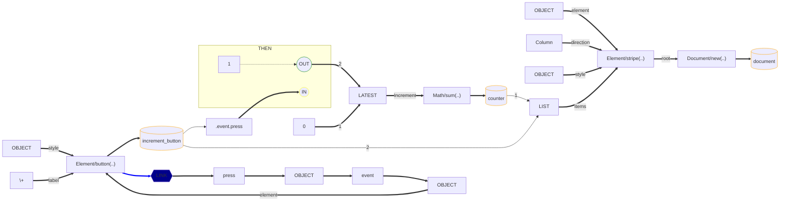

```mermaid
flowchart LR
    classDef root_variable_class stroke:Orange
    classDef function_input_class stroke:Yellow
    classDef function_output_class stroke:Green
    classDef link_class fill:DarkBlue

    VAR_document__1[("document")]:::root_variable_class
    CALL_Document_new__2["Document/new(..)"]
    CALL_Element_stripe__3["Element/stripe(..)"]
    OBJ__4["OBJECT"]
    TAG_Row__5["Column"]
    OBJ__6["OBJECT"]
    LIST__7["LIST"]

    VAR_counter__8[("counter")]:::root_variable_class
    CALL_Math_sum__9["Math/sum(..)"]
    LATEST__10["LATEST"]
    NUM_0__11["0"]
    GET_increment_button.event.press__12[".event.press"]

    subgraph THEN__13["THEN"]
        THEN_IN__14(("IN")):::function_input_class
        NUM_1__15["1"]
        THEN_OUT__16(("OUT")):::function_output_class

        NUM_1__15 .-> THEN_OUT__16
    end

    VAR_increment_button__17[("increment_button")]:::root_variable_class
    CALL_Element_button__18["Element/button(..)"]
    OBJECT__19["OBJECT"]
    VAR_event__20["event"]
    OBJECT__21["OBJECT"]
    VAR_press__22["press"]
    LIN__23{{"LINK"}}:::link_class
    OBJECT__24["OBJECT"]
    TXT_plus__25["\+"]

    CALL_Document_new__2 ==> VAR_document__1
    CALL_Element_stripe__3 ==> |"root"| CALL_Document_new__2
    OBJ__4 ==> |"element"| CALL_Element_stripe__3
    TAG_Row__5 ==> |"direction"| CALL_Element_stripe__3
    OBJ__6 ==> |"style"| CALL_Element_stripe__3
    LIST__7 ==> |"items"| CALL_Element_stripe__3

    VAR_counter__8 --> |"1"| LIST__7
    CALL_Math_sum__9 ==> VAR_counter__8
    LATEST__10 ==> |"Increment"| CALL_Math_sum__9
    NUM_0__11 ==> |"1"| LATEST__10
    THEN_OUT__16 ==> |"2"| LATEST__10

    GET_increment_button.event.press__12 ==> THEN_IN__14
    VAR_increment_button__17 --> GET_increment_button.event.press__12
    VAR_increment_button__17 --> |"2"| LIST__7
    CALL_Element_button__18 ==> VAR_increment_button__17
    CALL_Element_button__18 ==> LIN__23
    OBJECT__19 ==> |"element"| CALL_Element_button__18
    VAR_event__20 ==> OBJECT__19
    OBJECT__21 ==> VAR_event__20
    VAR_press__22 ==> OBJECT__21
    LIN__23 ==> VAR_press__22
    OBJECT__24 ==> |"style"| CALL_Element_button__18
    TXT_plus__25 ==> |"label"| CALL_Element_button__18

    linkStyle 16 stroke:Blue;
```
