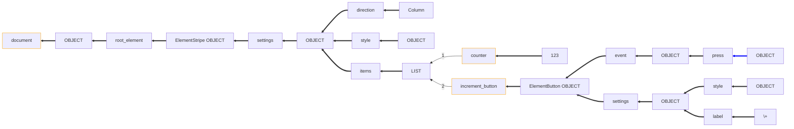

```mermaid
flowchart RL
    classDef root_variable_class stroke:Orange

    document__1["document"]:::root_variable_class
    OBJECT__2["OBJECT"]
    VAR_root_element__3["root_element"]
    VAR_ElementStripe_OBJECT__4["ElementStripe OBJECT"]
    VAR_settings__4["settings"]
    OBJECT__5["OBJECT"]
    VAR_direction__6["direction"]
    TAG_Column__7["Column"]
    VAR_style__8["style"]
    OBJECT__9["OBJECT"]
    VAR_items__10["items"]
    LIST__11["LIST"]
                            
    OBJECT__2 ==> document__1
    VAR_root_element__3 ==> OBJECT__2
    VAR_ElementStripe_OBJECT__4 ==> VAR_root_element__3
    VAR_settings__4 ==> VAR_ElementStripe_OBJECT__4
    OBJECT__5 ==> VAR_settings__4
    VAR_direction__6 ==> OBJECT__5
    TAG_Column__7 ==> VAR_direction__6
    VAR_style__8 ==> OBJECT__5
    OBJECT__9 ==> VAR_style__8
    VAR_items__10 ==> OBJECT__5
    LIST__11 ==> VAR_items__10

    counter__12["counter"]:::root_variable_class
    NUM_123__13["123"]
    
    NUM_123__13 ==> counter__12
    %% Ref
    counter__12 --> |"1"| LIST__11

    increment_button__14["increment_button"]:::root_variable_class
    VAR_ElementButton_OBJECT__15["ElementButton OBJECT"]
    VAR_event__16["event"]
    OBJECT__17["OBJECT"]
    VAR_press__18["press"]
    OBJECT__19["OBJECT"]
    VAR_settings__20["settings"]
    OBJECT__21["OBJECT"]
    VAR_style__22["style"]
    OBJECT__23["OBJECT"]
    VAR_label__24["label"]
    TXT_plus__25["\+"]

    %% Ref
    increment_button__14 --> |"2"| LIST__11
    VAR_ElementButton_OBJECT__15 ==> increment_button__14
    VAR_event__16 ==> VAR_ElementButton_OBJECT__15
    OBJECT__17 ==> VAR_event__16
    VAR_press__18 ==> OBJECT__17
    %% Ref
    OBJECT__19 ==> VAR_press__18
    VAR_settings__20 ==> VAR_ElementButton_OBJECT__15
    OBJECT__21 ==> VAR_settings__20
    VAR_style__22 ==> OBJECT__21
    OBJECT__23 ==> VAR_style__22
    VAR_label__24 ==> OBJECT__21
    TXT_plus__25 ==> VAR_label__24

    linkStyle 18 stroke:Blue;
```
