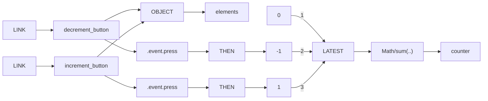

```mermaid
flowchart LR
    elements__1["elements"]
    OBJECT__2["OBJECT"]
    decrement_button__3["decrement_button"]
    increment_button__4["increment_button"]
    LINK__5["LINK"]
    LINK__6["LINK"]

    LINK__5 --> decrement_button__3
    decrement_button__3 --> OBJECT__2
    LINK__6 --> increment_button__4
    increment_button__4 --> OBJECT__2
    OBJECT__2 --> elements__1


    counter__7["counter"]
    LATEST__8["LATEST"]
    0__9["0"]
    elements.decrement_button.event.press__10[".event.press"]   
    elements.increment_button.event.press__11[".event.press"]
    THEN__12["THEN"]
    THEN__13["THEN"]
    -1__14["-1"]
    1__15["1"]   
    Math_sum__16["Math/sum(..)"]

    0__9 --> |1| LATEST__8
    elements.decrement_button.event.press__10 --> THEN__12
    THEN__12 --> -1__14
    elements.increment_button.event.press__11 --> THEN__13
    THEN__13 --> 1__15
    -1__14 --> |2| LATEST__8
    1__15 --> |3| LATEST__8
    LATEST__8 --> Math_sum__16
    Math_sum__16 --> counter__7

    decrement_button__3 --> elements.decrement_button.event.press__10
    increment_button__4 --> elements.increment_button.event.press__11


    %% Element_stripe["Element/stripe(..)"]
    %% Element_button["Element/button(..)"]
    %% Document_new["Document/new(..)"]
    %% root_element["root_element(..)"]
    %% counter_button["counter_button(..)"]

    %% 0 --> LATEST 
    %% elements.decrement_button.event.press --> -1
    %% elements.increment_button.event.press --> 1
    %% -1 --> LATEST 
    %% 1 --> LATEST
    %% LATEST --> Math_sum["Math/sum()"]
    %% Math_sum --> counter

    %% Element_stripe --> root_element
    %% counter --> Element_stripe
    %% counter_button --> Element_stripe

    %% Element_button --> counter_button

    %% elements.decrement_button --> elements.decrement_button.event.press
    %% elements.increment_button --> elements.increment_button.event.press
    
    %% root_element --> |LINK| elements.decrement_button
    %% root_element --> |LINK| elements.increment_button

    %% root_element --> Document_new
    %% Document_new --> document
```
