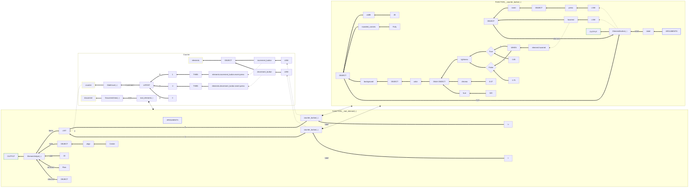

```mermaid
flowchart RL
    classDef root_variable_class stroke:yellow
    classDef function_arguments_class stroke:blue
    classDef function_output_class stroke:green

    subgraph graph_root["Counter"]
        direction RL
        style graph_root fill:transparent

        VAR_elements__1["elements"]:::root_variable_class
        OBJ__2["OBJECT"]
        VAR_decrement_button__3["decrement_button"]
        VAR_increment_button__4["increment_button"]
        LIN__5["LINK"]
        LIN__6["LINK"]

        LIN__5 ==> VAR_decrement_button__3
        VAR_decrement_button__3 ==> OBJ__2
        LIN__6 ==> VAR_increment_button__4
        VAR_increment_button__4 ==> OBJ__2
        OBJ__2 ==> VAR_elements__1


        VAR_counter__7["counter"]:::root_variable_class
        LATEST__8["LATEST"]
        NUM_0__9["0"]
        GET_elements.decrement_button.event.press__10["elements.decrement_button.event.press"]   
        GET_elements.increment_button.event.press__11["elements.increment_button.event.press"]
        THEN__12["THEN"]
        THEN__13["THEN"]
        NUM_minus_1__14["-1"]
        NUM_1__15["1"]   
        CALL_Math_sum__16["Math/sum(..)"]

        NUM_0__9 ==> |"1"| LATEST__8
        GET_elements.decrement_button.event.press__10 ==> THEN__12
        THEN__12 ==> NUM_minus_1__14
        GET_elements.increment_button.event.press__11 ==> THEN__13
        THEN__13 ==> NUM_1__15
        NUM_minus_1__14 ==> |"2"| LATEST__8
        NUM_1__15 ==> |"3"| LATEST__8
        LATEST__8 ==> |"Increment"| CALL_Math_sum__16
        CALL_Math_sum__16 ==> VAR_counter__7
        VAR_decrement_button__3 .-> GET_elements.decrement_button.event.press__10
        VAR_increment_button__4 .-> GET_elements.increment_button.event.press__11


        VAR_document__17["document"]:::root_variable_class
        CALL_Document_new__18["Document/new(..)"]
        CALL_root_element__19["root_element(..)"]

        CALL_root_element__19 ==> |"root"| CALL_Document_new__18
        CALL_Document_new__18 ==> VAR_document__17
    end

    subgraph FUNCTION_root_element__20["FUNCTION__root_element(..)"]
        direction RL
        ARGUMENTS__46["ARGUMENTS"]:::function_arguments_class
        OUTPUT__47["OUTPUT"]:::function_output_class

        CALL_Element_stripe__21["Element/stripe(..)"]
        OBJ__22["OBJECT"]
        TAG_Row__23["Row"]
        NUM_15__24["15"]
        OBJ__25["OBJECT"]
        VAR_align__26["align"]
        TAG_Center__27["Center"]
        LIST__28["LIST"]
        CALL_counter_button__29["counter_button(..)"]
        CALL_counter_button__30["counter_button(..)"]
        TXT_minus__31["\-"]
        TXT_plus__32["\+"]

        OBJ__22 ==> |"element"| CALL_Element_stripe__21
        TAG_Row__23 ==> |"direction"| CALL_Element_stripe__21
        NUM_15__24 ==> |"gap"| CALL_Element_stripe__21
        OBJ__25 ==> |"style"| CALL_Element_stripe__21
        LIST__28 ==> |"items"| CALL_Element_stripe__21

        VAR_align__26 ==> OBJ__25
        TAG_Center__27 ==> VAR_align__26

        TXT_minus__31 ==> |"label"| CALL_counter_button__29
        TXT_plus__32 ==> |"label"| CALL_counter_button__30

        CALL_counter_button__29 ==> |"1"| LIST__28
        VAR_counter__7 .-> |"2"| LIST__28
        CALL_counter_button__30 ==> |"3"| LIST__28

        CALL_counter_button__29 .-> LIN__5
        CALL_counter_button__30 .-> LIN__6

        CALL_Element_stripe__21 ==> OUTPUT__47
    end

    subgraph FUNCTION_counter_button__33["FUNCTION__counter_button(..)"]
        direction RL
        ARGUMENTS__48["ARGUMENTS"]:::function_arguments_class
        OUTPUT__49["OUTPUT"]:::function_output_class

        CALL_Element_button__33["Element/button(..)"]
        
        OBJECT__34["OBJECT"]
        VAR_event__35["event"]
        OBJECT__36["OBJECT"]
        VAR_press__37["press"]
        LINK__38["LINK"]
        VAR_hovered__39["hovered"]
        LINK__40["LINK"]

        OBJECT__41["OBJECT"]
        VAR_width__43["width"]
        VAR_rounded_corners__44["rounded_corners"]
        VAR_background__45["background"]
        ARG_label__46["label"]

        NUM_45__47["45"]
        TAG_Fully_48["Fully"]
        OBJECT__49["OBJECT"]
        VAR_color__50["color"]
        OBJECT_Oklch__51["Oklch OBJECT"]
        VAR_lightness__52["lightness"]
        VAR_chroma__53["chroma"]
        VAR_hue__54["hue"]
        NUM_0.07__55["0.07"]
        NUM_320__56["320"]

        GET_element.hovered__57["element.hovered"]
        WHEN__58["WHEN"]
        ARM_True__59{"True"}
        ARM_False__60{"False"}
        NUM_0.85__61["0.85"]
        NUM_0.75__62["0.75"]

        ARGUMENTS__48 ==> ARG_label__46

        OBJECT__34 ==> |"element"| CALL_Element_button__33
        VAR_event__35 ==> OBJECT__34
        OBJECT__36 ==> VAR_event__35
        VAR_press__37 ==> OBJECT__36
        LINK__38 ==> VAR_press__37
        VAR_hovered__39 ==> OBJECT__34
        LINK__40 ==> VAR_hovered__39

        OBJECT__41 ==> |"style"| CALL_Element_button__33
        VAR_width__43 ==> OBJECT__41
        VAR_rounded_corners__44 ==> OBJECT__41
        VAR_background__45 ==> OBJECT__41

        NUM_45__47 ==> VAR_width__43
        TAG_Fully_48 ==> VAR_rounded_corners__44
        OBJECT__49 ==> VAR_background__45
        VAR_color__50 ==> OBJECT__49
        OBJECT_Oklch__51 ==> VAR_color__50
        VAR_lightness__52 ==> OBJECT_Oklch__51
        VAR_chroma__53 ==> OBJECT_Oklch__51
        VAR_hue__54 ==> OBJECT_Oklch__51
        NUM_0.07__55 ==> VAR_chroma__53
        NUM_320__56 ==> VAR_hue__54

        GET_element.hovered__57 ==> WHEN__58
        WHEN__58 ==> |"1"| ARM_True__59
        NUM_0.85__61 ==> ARM_True__59
        WHEN__58 ==> |"2"| ARM_False__60
        NUM_0.75__62 ==> ARM_False__60
        ARM_True__59 ==> VAR_lightness__52
        ARM_False__60 ==> VAR_lightness__52
        VAR_hovered__39 .-> GET_element.hovered__57

        ARG_label__46 ==> |"label"| CALL_Element_button__33

        CALL_Element_button__33 ==> OUTPUT__49

        CALL_Element_button__33 .-> LINK__38
        CALL_Element_button__33 .-> LINK__40
    end

    FUNCTION_root_element__20 o--o CALL_root_element__19
    FUNCTION_counter_button__33 o--o CALL_counter_button__29
    FUNCTION_counter_button__33 o--o CALL_counter_button__30
```
