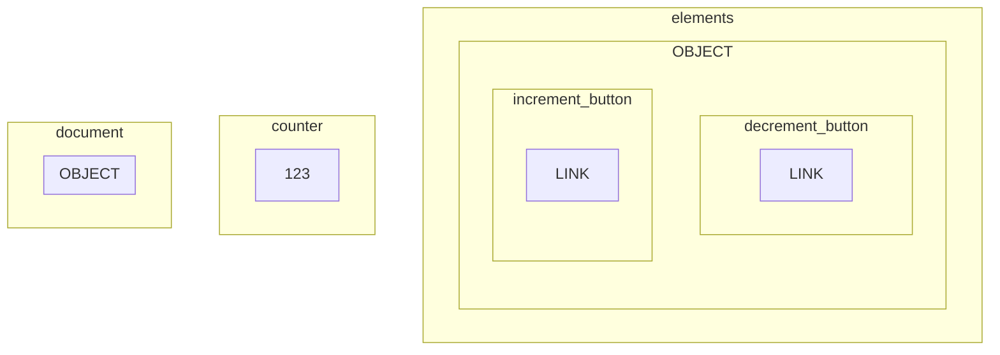

```mermaid
flowchart
    subgraph elements["elements"]
        subgraph elements_OBJECT["OBJECT"]
            subgraph elements.decrement_button["decrement_button"]
                elements.decrement_button.LINK["LINK"]
            end

            subgraph increment_button
                elements.increment_button.LINK["LINK"]
            end
        end
    end

    subgraph counter
        123
    end

    subgraph document
        subgraph document.OBJECT["OBJECT"]
            
        end
    end
```
