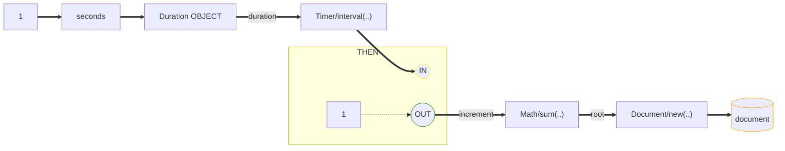

```mermaid
flowchart LR
    classDef root_variable_class stroke:Orange
    classDef function_input_class stroke:Yellow
    classDef function_output_class stroke:Green

    NUM_1__1["1"]
    VAR_seconds__2["seconds"]
    Duration_OBJECT__3["Duration OBJECT"]
    CALL_Timer_interval__4["Timer/interval(..)"]
    CALL_Math_sum__5["Math/sum(..)"]
    CALL_Document_new__6["Document/new(..)"]
    VAR_document__7[("document")]:::root_variable_class

    subgraph THEN__8["THEN"]
        THEN_IN__9(("IN")):::function_input_class
        NUM_1__10["1"]
        THEN_OUT__11(("OUT")):::function_output_class

        NUM_1__10 .-> THEN_OUT__11
    end

    NUM_1__1 ==> VAR_seconds__2
    VAR_seconds__2 ==> Duration_OBJECT__3
    Duration_OBJECT__3 ==> |"duration"| CALL_Timer_interval__4
    CALL_Timer_interval__4 ==> THEN_IN__9
    THEN_OUT__11 ==> |"increment"| CALL_Math_sum__5
    CALL_Math_sum__5 ==> |"root"| CALL_Document_new__6
    CALL_Document_new__6 ==> VAR_document__7
```
