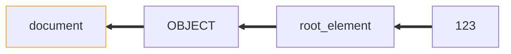

```mermaid
flowchart RL
    classDef root_variable_class stroke:Orange
    
    document__0["document"]:::root_variable_class
    OBJECT__1["OBJECT"]
    VAR_root_element__2["root_element"]
    NUM_123__3["123"]

    OBJECT__1 ==> document__0
    VAR_root_element__2 ==> OBJECT__1
    NUM_123__3 ==> VAR_root_element__2
```
